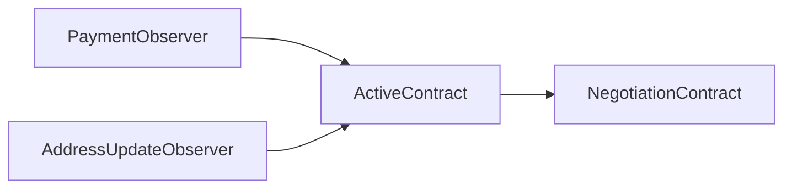

# Cardano-Loans: A Peer-to-Peer Lending Protocol for the Real Economy

Cardano-Loans provides the essential infrastructure for a stable and inclusive credit market on the
blockchain. It moves beyond speculation by enabling productive, real-world lending.

- **For Lenders & Borrowers:** Engage in stable, **non-margin loans**. Your collateral is only at
risk from loan default, not market volatility, making it safe for entrepreneurs and long-term
holders.
- **For User Sovereignty:** Never give up control. The DeFi Kernel architecture guarantees you
retain **100% self-custody** of your assets and your ADA staking rights at all times.
- **For the Ecosystem:** Build a sophisticated financial system with tradable "**Lender Bonds**" and
a trustless on-chain reputation system—the foundational primitives for creating loan-backed
securities and other advanced products.

> [!TIP]
> The Getting Started instructions can be found [here](./GettingStarted.md) and the benchmarks can
> be found [here](./Benchmarks.md).

---
## Table of Contents 
- [Abstract](#abstract)
- [Motivation: Diagnosing the Flaws in Contemporary DeFi](#motivation-diagnosing-the-flaws-in-contemporary-defi)
- [Introducing Cardano-Loans: The Solution](#introducing-cardano-loans-the-solution)
- [Feature Discussion](#feature-discussion)
- [Adoption Strategy: Targeting Sophisticated Lenders as the Catalyst for a Grassroots Credit Market](#adoption-strategy-targeting-sophisticated-lenders-as-the-catalyst-for-a-grassroots-credit-market)
- [Specification](#specification)
- [Benchmarks and Fee Estimations](#benchmarks-and-fee-estimations-ymmv)
- [Conclusion](#conclusion)

## Abstract

Contemporary DeFi credit markets are fundamentally misaligned with real economic activity. As a
consequence of this misalignment, DeFi loans are mostly used for asset speculation. The misalignment
itself is a direct product of their flawed design, which almost exclusively offers high-risk margin
loans unsuitable for productive enterprise. Furthermore, their core primitives actively prevent the
creation of sophisticated financial layers; features like borrower bonds, which allow debt to be
sold without lender consent, make risk unmanageable and the creation of assets like loan-backed
securities and tranches impossible. Their flawed design also betrays the core promise to bank the
unbanked, as they lack foundational support for the unsecured loans and trustless reputation systems
(e.g., credit histories) necessary to bootstrap financial inclusion. Finally, these flawed systems
force users into an unacceptable compromise, demanding they sacrifice self-sovereignty by ceding
custody and control to participate.

Cardano-Loans is engineered from first principles to solve these failures. It introduces
economically useful non-margin loans, provides the framework for unsecured credit and on-chain
reputations, and is built for true financial composability, ensuring lenders retain the risk control
necessary to build a layered credit market. As a foundational primitive of the DeFi Kernel, it
guarantees users always maintain full self-sovereignty. It is the essential infrastructure to move
beyond the DeFi casino and begin building a robust, inclusive, and layered financial ecosystem on
Cardano.

## Motivation: Diagnosing the Flaws in Contemporary DeFi

The promise of Decentralized Finance (DeFi) is to build a more open, efficient, and equitable
financial system. Yet, the current DeFi credit landscape has demonstrably failed to live up to this
promise. Its design flaws have created a system that primarily serves speculators, excludes the
neediest, and fundamentally conflicts with the core principles of decentralization. To build a
better system, one must first understand these failures in detail.

### 1. The Primacy of Margin Loans: A Market Built for Gambling, Not Growth

The vast majority of loans in DeFi today are **margin loans**. In this model, a borrower’s
collateral is subject to automated, forced liquidation if its market value drops below a certain
threshold. This mechanism is ideal for one specific activity: **leveraged speculation**. Traders use
margin loans to amplify their bets on asset prices, accepting the risk of liquidation as the cost of
potential high returns.

However, this model is fundamentally toxic for real economic enterprise. Imagine an entrepreneur
securing a loan to fund a startup, using their crypto assets as collateral. A sudden, temporary
market downturn—or even a faulty price oracle feed—could trigger a forced sale of their collateral,
instantly bankrupting their business regardless of their intent or ability to repay the loan.
Similarly, a long-term holder ("HODLer") who has weathered 90% bear markets is unwilling to accept a
system that could force-sell their core assets due to short-term volatility.

This stands in stark contrast to traditional finance (TradFi), where the overwhelming majority of
productive credit, from mortgages to small business loans, are **non-margin loans**. In TradFi,
collateral is only seized upon a definitive loan default—a failure to pay—not because of unrelated
market fluctuations. By prioritizing margin loans, DeFi has inadvertently built a casino while
neglecting the tools needed for genuine wealth creation.

### 2. Preventing Financial Sophistication: The Impossibility of Layering

Mature credit markets create stability and attract vast amounts of capital by managing risk through
layering. This process is described in detail in this [blog post][1], but the core idea is that
individual loans (Layer 1) are bundled into diversified loan-backed securities (Layer 2) whose cash
flows are then sliced into different risk bands called tranches (Layer 3). This process makes
lending safer and more accessible to a wider range of investors.

> [!IMPORTANT]
> **It is all about risk-management.** Each layer minimizes the risk of the preceding layer which
> attracts more risk-averse capital into the credit market. For example, there is a higher risk of
> loss lending to a single borrower than there is in buying a loan-backed security made up of
> diversified loans to borrowers. The impact of this layering on the available capital is
> non-linear: securitized loans can attract 10x more capital than the individual lending market
> could alone.

Current DeFi protocols make this essential layering impossible due to two critical design flaws:

- **Borrower-Centric Debt Instruments:** Many protocols feature "borrower bonds," which allow the
borrower to sell their debt obligation to another party without the lender's consent. This
fundamentally breaks risk management. A lender who vetted Borrower A cannot build a reliable
loan-backed security if that debt can be unpredictably transferred to the unvetted and potentially
less creditworthy Borrower B. Lenders lose control over their risk, making securitization a
non-starter. This is why most TradFi loans do not support "Borrower Bonds".
- **Lack of Trustless Reputation:** Without a reliable, on-chain credit history, lenders cannot
accurately price the risk of the individual loans they issue. This opacity makes it nearly
impossible to confidently package these loans into a security with a predictable risk profile for
potential investors. A robust reputation system is a prerequisite for a transparent and trustworthy
layered credit market.

### 3. Betraying the Promise: The Exclusion of the Unbanked

DeFi’s most noble goal is to "bank the unbanked." Yet, the current system does the exact opposite.
By demanding that all loans be over-collateralized, DeFi creates an inescapable paradox for those it
claims to help. The unbanked, by virtue of being unbanked, do not have the assets to post as
collateral. To get a loan, you need capital; to get capital, you need a loan. It's a closed loop
that permanently excludes the financially underserved.

The initial spark of all economic inclusion begins with unsecured loans. From the first credit card
offered to a young person to the microloans provided by organizations like Kiva in the developing
world, small, unsecured lines of credit are the first rung on the financial ladder. They allow
individuals to build a credit history, start small businesses, and accumulate the very assets that
can later be used for collateralized loans. By failing to provide a framework for unsecured lending,
DeFi has cut off the only viable entry point for billions of people.

> [!IMPORTANT]
> There is a common misconception that DeFi cannot support unsecured loans because borrowers will
> just run away with the loan amount. But this isn't true in a DeFi/TradFi hybrid model: local
> lenders give loans using the DeFi protocol **only after** conducting TradFi background checks.
> So the user-facing service of unsecured loans doesn't change from how it works in TradFi, but the
> backend is swapped out for a DeFi protocol that trustlessly enforces the loan and tracks the
> borrower's reputation over time.

You can read more about this topic in this [blog post][2].

### 4. The Sovereignty Conflict: Forcing Users to Cede Control

The philosophical foundation of Cardano is user sovereignty, expressed through direct asset custody
and participation in network consensus and governance via ADA delegation. Prevailing DeFi models
force users into a direct conflict with this ethos. To participate, users must deposit their assets
into large, shared smart contracts, effectively ceding control to the protocol's DAO or a small
group of multi-sig key holders.

This presents two unacceptable compromises:

- **Sacrificing Custody:** Users give up direct control of their funds, exposing them to protocol
exploits, hacks, and centralized decision-making.

- **Sacrificing Delegation:** The protocol gains control over the ADA's delegation rights, silencing
the user's voice in securing the network and shaping its future. This systemic risk could lead to a
handful of popular dApps centralizing control over Cardano's consensus and democracy.

The Cardano community has overwhelmingly rejected this flawed model. This is not a theoretical
problem—it is an economic reality. The fact that a staggering [99% of Cardano's potential liquidity
sits on the sidelines][3], disengaged from its DeFi ecosystem, is a clear market signal. It is a
rational vote of no-confidence in a system that demands users compromise their core principles of
sovereignty in exchange for participation.

## Introducing Cardano-Loans: The Solution

Cardano-Loans is engineered from first principles to correct the fundamental flaws of contemporary
DeFi. It is not an incremental improvement but a foundational primitive designed to serve as the
bedrock for a robust, inclusive, and sovereign credit market. By addressing each of the failures
identified above, it provides the tools for real economic activity, financial layering, and true
decentralization.

### 1. Enabling Economically Productive Credit: Beyond Speculation

Cardano-Loans facilitates true non-margin loans. The protocol is built on a simple, powerful
principle: **liquidation only occurs upon definitive borrower default, not market volatility.**

Lenders and borrowers agree on terms upfront, including collateral rates and repayment schedules. As
long as the borrower meets their obligations, their collateral is safe, regardless of transient
market dips or price oracle fluctuations. This stability is essential for productive enterprise,
allowing entrepreneurs to fund businesses and individuals to unlock liquidity from their assets
without the existential threat of a forced margin call. It aligns DeFi with the time-tested credit
models that power real-world economies.

> [!IMPORTANT]
> If the value of the collateral ever falls to low **that is the lender's fault**! Why should the
> borrower be punished because the lender didn't manage the risk properly?

### 2. Built for Composability: A Foundation for Layered Finance

The protocol is explicitly designed to enable the creation of a sophisticated, layered credit
market. It achieves this by solving the core issues that block financial composition in other
protocols:

- **Lender-Centric Design with "Lender Bonds":** When a loan is created, the lender receives a
unique token representing their position as the creditor. This "Lender Bond" is a tradable on-chain
asset. The lender can sell or transfer this bond, and the protocol ensures that all future loan
payments are routed to the new owner. Crucially, the borrower's obligations and the loan's terms
remain unchanged. This provides potential exit liquidity for lenders while maintaining the integrity
of the original loan, allowing for predictable risk management—the essential prerequisite for
creating loan-backed securities.
- **Integrated Trustless Reputation:** The protocol is a reputation engine. Every loan
event—origination, timely payment, missed payment, default, and full repayment—is immutably recorded
on-chain and tied to the participants' on-chain identities. This creates a transparent and auditable
credit history. Lenders can use this data to more accurately assess risk, and borrowers can leverage
their good history to secure better terms in the future. This reputation becomes a form of "social
collateral" that underpins the entire system's integrity.

> [!IMPORTANT]
> **Lenders also get a trustless lender reputation based on how successful at lending.** This helps
> bootstrap the trust in the higher credit layers: if you see a loan to a new borrower from a lender
> with a good reputation, buyers of a loan backed security containing this loan will be more willing
> to buy the security.

### 3. Banking the Unbanked: A Framework for Financial Inclusion

Cardano-Loans provides the necessary infrastructure to finally bank the unbanked by natively
supporting unsecured and under-collateralized loans.

The protocol doesn't pretend to solve the identity problem in a purely anonymous environment.
Instead, it provides the on-chain rails for a DeFi/TradFi hybrid model. Local lending businesses can
perform off-chain vetting and due diligence, then use the Cardano-Loans protocol as the trustless
backend to enforce the loan terms and build the borrower’s on-chain credit history. This allows
individuals to take their first step onto the financial ladder with a small unsecured loan and build
the verifiable reputation needed to access more and better credit over time, creating a true path
toward financial empowerment.

> [!IMPORTANT]
> Eventually, these new borrowers will have enough of an on-chain reputation to possibly attract an
> international loan. If they default on this international loan, it will trustlessly impact their
> reputation and they will get worse rates when they go back to their local lenders. As a
> consequence, these borrowers are incentivized to still act honestly with these international
> lenders. This is how the "federated credit network" can evolve into a globally distributed credit
> network.

### 4. Upholding User Sovereignty: The DeFi Kernel Approach

Cardano-Loans is built as a foundational primitive of the **DeFi Kernel**, ensuring that user
sovereignty is never compromised. This is achieved through its core architecture:

- **Individual Smart Contract Instances:** Each user interacts with their own dedicated,
user-controlled smart contract. There are no large, shared pools of capital where assets are
commingled.

- **Guaranteed Self-Custody and Delegation:** Because users interact with their own contracts, they
never cede custody of their assets or control over their ADA delegation rights. Their funds remain
theirs, and their voice in the Cardano ecosystem remains their own.

This sovereign-first approach directly solves the conflict that has kept 99% of Cardano's liquidity
on the sidelines. It makes participation in DeFi a rational, safe, and principled decision, creating
the trust necessary to unlock the full financial potential of the Cardano community.

## Feature Discussion

The Cardano-Loans protocol is built on a set of core features designed to create a flexible, secure,
and economically productive credit market. This section explores these key design elements in more
detail.

### The DeFi Kernel and User Sovereignty

At the heart of the protocol is its adherence to the DeFi Kernel architecture, which is
non-negotiable for true decentralization on Cardano. Unlike pooled models where users surrender
their assets to a central contract, Cardano-Loans operates on individual, user-controlled smart
contract instances. Following [CIP-89][4], each user's loans, offers, and collateral are held at
their own dApp address. The validator script for this address delegates all control to the user's
staking credential.

This design has two consequences:

- **Unbreakable Self-Custody:** At no point do users lose control of their assets. They remain in
the user’s address, secured by the user’s keys. This eliminates the systemic risk of protocol hacks
draining a central liquidity pool.
- **Preservation of Delegation Rights:** Because the user's ADA never leaves their control, their
right to stake and participate in on-chain governance is always preserved. This prevents the
centralization of network consensus into the hands of a few large DeFi protocols.

### Lender Bonds: The Engine of Composability

To build a layered financial system, the underlying debt instruments must be stable and transferable
from the lender's perspective. The protocol introduces Lender Bonds, represented by a unique "Key
NFT" minted for each loan. This NFT serves as the lender's proof of ownership over the debt.

The owner of the Key NFT is the sole entity entitled to receive the loan's repayments. The key
innovation is that this bond can be sold or transferred on a secondary market without affecting the
borrower's obligations. The new owner of the Key NFT can update the required payment address and the
protocol will trustlessly ensure that payments are routed to the current holder of the Key NFT. This
provides lenders with exit liquidity and, more importantly, creates a stable, predictable asset (the
loan's cash flow) that can be packaged into loan-backed securities, forming the essential second
layer of a mature credit market.

### Trustless Reputation: The Foundation of Risk Assessment

The protocol is a powerful engine for generating immutable, on-chain reputations for both borrowers
and lenders.

- **Borrower's Credit History:** A borrower’s on-chain identity is linked to their staking
credential (the `Borrower ID` beacon). Every loan they undertake is tracked on-chain. The final
transaction that concludes the loan—whether a full repayment (`MakePayment` redeemer) or a default
(`SpendWithKeyNFT` redeemer)—serves as a permanent, publicly verifiable record of the outcome. This
creates a trustless credit history that any future lender can audit to assess risk.
- **Lender's Track Record:** A lender's reputation is built by tracking the performance of all loans
they originate (identified by their `Lender ID` beacon). By observing the outcomes of the loans
associated with this `Lender ID`, the market can calculate their success rate. A lender with a
proven track record of underwriting successful loans becomes a trusted entity, making their loan
bonds more valuable and their participation in securitization more attractive.

### The Emergent DID and Economic Web of Trust

A powerful consequence of this architecture is the creation of an emergent Decentralized Identifier
(DID). Because a user's staking credential serves as the consistent identifier for all of their
activity within Cardano-Loans—and across all other DeFi Kernel protocols—it becomes a persistent,
pseudonymous on-chain identity. The sum of a user's loan history, DEX trades, and other on-chain
actions forms a rich, auditable *economic fingerprint*, providing a strong signal that they are a
real, economically significant participant.

This gives rise to a layered and voluntary model for on-chain identity:

- **Layer 1: Pseudonymous Reputation (The Emergent DID):** The baseline identity is the staking
credential itself, with its publicly verifiable history of transactions and loan outcomes. This
history acts as a form of "social collateral," allowing users to build trust without revealing their
real-world identity.
- **Layer 2: Verifiable Credentials (KYC/KYB):** For users or institutions that require it, a
Know-Your-Customer (KYC) or Know-Your-Business (KYB) provider can issue a verifiable credential that
cryptographically links a real-world identity to the staking credential. This is an optional,
additive layer that builds upon the foundational on-chain reputation.

Furthermore, this system bootstraps a dynamic, economic "web of trust." When a lender with a strong
on-chain reputation issues a loan to a new borrower, it acts as a powerful, verifiable endorsement.
This "co-signing" by a trusted entity is backed by quantifiable economic risk, making it a far
stronger signal than a simple social connection. It allows new, creditworthy participants to build
trust rapidly, creating a decentralized and auditable alternative to traditional credit scoring.

### How Lenders Manage Risk: Bringing TradFi Prudence to DeFi

A common question for any non-margin lending protocol is: "Without automated liquidations, how do
lenders protect themselves from collateral volatility?" Contemporary DeFi has conditioned users to
see reactive, price-based liquidation as the only form of risk management.

Cardano-Loans rejects this volatile and often destructive model in favor of a return to first
principles. The protocol empowers lenders to manage risk proactively through diligent underwriting
and intelligent loan structuring—the same principles that have successfully governed traditional
credit markets for centuries. The key innovation is implementing these proven strategies in a
globally accessible, transparent, and trustless on-chain environment.

Lenders are equipped with a powerful on-chain toolkit for underwriting, allowing them to retain full
control over their risk exposure.

1. **Diligent Collateralization:** The lender's first and most important line of defense.
    - **Asset Quality:** Lenders are never forced to accept collateral they deem too risky. They
    have full discretion to assess the quality of the assets offered and can set custom
    collateralization price ratios to create a sufficient buffer against volatility.
    - **Over-Collateralization Ratios:** The lender has complete control to set the required
    over-collateralization in their `OfferDatum`. For a volatile asset, a lender might demand a 3:1
    or 4:1 ratio, providing a significant safety margin determined by their own risk appetite, not
    by a rigid protocol parameter.
2. **Intelligent Loan Structuring:** Aligning the loan's terms with its risk profile.
    - **Loan Duration (`loanTerm`):** Risk increases over time. Lenders can limit their exposure to
    market downturns by offering shorter-duration loans for assets they perceive as more volatile.
    - **Performance Covenants (`maxConsecutiveMisses`):** This is the protocol's crucial,
    performance-based alternative to margin calls. Instead of liquidating based on a volatile price
    feed, default is determined by the borrower's actions. If a borrower fails to make payments and
    exceeds the `maxConsecutiveMisses` threshold, the lender can terminate the loan and claim the
    entire collateral. This protects the lender from what truly matters: a non-performing loan.
3. **Data-Driven Risk Assessment:** Leveraging the unique advantages of the blockchain.
    - **Trustless Reputation:** Lenders are not operating in a vacuum. They have access to an
    immutable, on-chain credit history via the `Borrower ID`. A borrower's public track record of
    successfully repaid loans is a transparent, verifiable signal of their creditworthiness,
    allowing lenders to make data-driven decisions. They can offer better terms to reputable
    borrowers and take a more cautious, highly-collateralized approach with new participants.
4. **Market-Based Exit Liquidity:** Providing flexibility through **Lender Bonds**.
    - If a lender's risk assessment of a loan changes, they are not locked into the position until
    maturity. The Lender Bond they hold is a liquid asset. They can sell it on a secondary market at
    any time, transferring the position to another party at a market-determined price. This provides
    an immediate and flexible exit strategy, allowing for active portfolio management.

By combining these tools, Cardano-Loans facilitates a more sophisticated and stable credit market.
It shifts the paradigm from reactive, automated liquidations to proactive, intelligent underwriting,
placing control firmly back into the hands of the lender.

### Dynamic Collateral: Unlocking Capital Efficiency

Unlike protocols that treat collateral as a static lockbox, Cardano-Loans views it as active
capital. The protocol empowers borrowers to dynamically withdraw collateral, creating a highly
efficient and flexible credit environment.

The mechanism is simple and transactional: **the fraction of collateral a borrower can reclaim is
proportional to the fraction of the outstanding balance they repay in that specific transaction.**
This allows a borrower to immediately free up their assets. The reclaimed collateral is not dead
capital; it can be used to secure new loans, provide liquidity, or capitalize on other
time-sensitive opportunities.

This flexibility does not compromise lender security. Lenders are protected not by a rigid LTV peg,
but by their on-chain right to terminate a non-performing loan early via the `maxConsecutiveMisses`
parameter—a clear, performance-based backstop that requires no price oracles.

For entrepreneurs, builders, and active market participants, this is a critical feature that allows
them to manage their capital intelligently and maximize its productive potential, all while
maintaining the security guarantees required by the lender.

### Flexible Loan Terms: Beyond Simple Debt

The protocol's rich parameter set allows for a wide variety of loan structures, all trustlessly
enforced on-chain. This flexibility allows the protocol to serve a vast range of use cases, from
simple personal loans to complex, structured financial agreements. Key features include:

- **Customizable Repayment Schedules:** Through the `epochDuration` and `minPayment` parameters,
parties can agree to periodic payments, simple bullet loans, or anything in between.
- **Penalty Mechanisms:** Lenders can incentivize timely payments by defining penalties (`FixedFee`
or `PercentFee`) that are automatically applied to the outstanding balance if the minimum payment
for an epoch is missed.
- **Early Loan Termination:** Lenders can set a maximum number of payments a borrower can miss in a
row before it is grounds for early termination. When a loan is terminated early, the lender claims
all remaining collateral backing the loan.
- **Compounding vs. Simple Interest vs. Interest Free:** The protocol supports both compounding,
non-compounding, and interest-free loans, offering flexibility for different financial products.
- **Native Support for All Assets:** All Cardano native assets, both present and future ones, are
already supported out of the box.
- **Multi-Collateral Loans:** Borrowers can use a basket of assets as collateral for a loan, with no
limit to the number of assets that can be included.
- **Customizable Collateralization:** Lenders and borrowers can agree to any collateral level they
choose by setting the relative asset values. This enables over-collateralized, fully-collateralized,
under-collateralized, and even fully unsecured loans.
- **Collateral Swapping:** Lenders can choose to make an offer more attractive by enabling the
`collateralIsSwappable` flag, which allows the borrower to substitute different types of collateral
during the loan's lifetime, provided the total value requirement is still met.

This flexibility allows the protocol to serve a vast range of use cases, from simple personal loans
to more complex, structured financial agreements.

## Adoption Strategy: Targeting Sophisticated Lenders as the Catalyst for a Grassroots Credit Market

A potential critique of the Cardano-Loans protocol is that its reliance on manual underwriting and
proactive risk management may deter casual, risk-averse lenders. However, this is not an oversight;
it is a deliberate, strategic choice that aligns with a phased, real-world adoption roadmap.
Attempting to attract casual lenders from day one would be pushing adoption out of order and would
fail to build a sustainable foundation.

The strategy is to deliberately target **sophisticated lenders** (i.e., experienced individuals
and/or professional businesses) as the protocol's **Early Adopters**. These are the actors who
possess the expertise to manage risk and are actively seeking the first-mover advantage that a new,
hyper-efficient credit market provides. For this group, the granular control offered by
Cardano-Loans is a powerful feature, not a burden.

> [!NOTE]  
> **The Catalyst, Not Critical Mass**
>
> A common misconception is that a new market needs a "critical mass" of users to get started. This
> is not true for a global, permissionless protocol.
>
> True grassroots adoption is not about attracting a crowd; it's about **finding a single catalyst**.
>
> In a worldwide market of millions, the probability of attracting at least a handful of pioneering
> lenders is extremely high. Only one of them needs to issue a successful, profitable loan. That
> single on-chain success story becomes the verifiable proof—the catalyst—that validates the model
> and attracts the next wave of lenders (`1 -> 2 -> 4 -> 8...`).
>
> This dynamic de-risks the launch. The protocol doesn't need to hope for a crowd; it simply needs
> to be robust enough to ensure its first pioneers can succeed.

This approach directly addresses the primary obstacle holding back DeFi's global adoption: the lack
of a proven, productive use case beyond speculation. By equipping sophisticated lenders with the
tools to issue stable, non-margin loans, Cardano-Loans becomes the engine for a virtuous, grassroots
economic cycle:

1. **Seeding Productive Enterprise:** Sophisticated lenders deploy capital to entrepreneurs in
   developing markets—the exact demographic that traditional finance cannot efficiently serve.
2. **Creating Real-World Value:** Borrowers use these non-margin loans to fund businesses, build
   infrastructure (like the internet access mentioned in the [DeFi Adoption Roadmap][7]), and create
tangible economic wealth.
3. **Maturing the Market Organically:** This real-world utility has two crucial feedback effects.
   First, newly created wealth flows back into the protocol, organically deepening liquidity.
Second, as the collateral assets are increasingly tied to productive activity, their long-term value
stabilizes.

This organic maturation process is what will eventually attract the **Early Majority** (the casual
lenders). They will enter a market that has already been de-risked by the pioneering efforts of the
Early Adopters. The collateral will be more stable, the success stories will be verifiable on-chain,
and the risk will be far easier to manage.

In short, the "challenges" of manual risk management are only challenges if the goal is premature
mass adoption. The goal is sustainable, grassroots growth. By focusing on sophisticated lenders
first, we are not excluding casual users; we are building the stable and liquid foundation upon
which they will eventually thrive.

## Specification

This section provides the low-level technical specification for the Cardano-Loans protocol. It is
intended for developers and auditors. Other readers should feel free to skip to the next
section.

<details>
<summary><b>Click to expand the full Technical Specification</b></summary>

### 1. Core Primitives & On-Chain State

##### The User dApp Address

Following [CIP-89][4], the protocol is built around a user-controlled dApp address, which serves as
the sovereign container for all of a user's loan activities.

- **Architecture:** The address uses a single protocol validator script for the payment credential
and a unique, user-defined key or script for the staking credential.
- **Sovereignty:** The validator delegates all ownership-related actions to the user's staking
credential. This ensures the user always maintains full custody of all assets at the address,
including collateral and open offers. This also means the user retains staking and voting rights
over all ADA held at the address.
- **Identity:** The user's staking credential serves as their cryptographic on-chain identity (e.g,
Borrower ID or Lender ID) to which their reputation is tied. 

> [!IMPORTANT]
> Since the user's staking credential can be a script, it is possible for another dApp to act as a
> borrower or lender for Cardano-Loans.

##### On-Chain State: UTxOs and Beacons

The protocol's state is represented by three primary UTxO types, which are made discoverable by
CIP-89 beacon tokens.

> [!NOTE]
> The strings ("Ask", "Offer", "Active", "Asset") in the derivations must be converted to
> hexidecimal.

- **Ask UTxO:** Created by a borrower at their dApp address to signal a request for a loan. It
contains the desired loan terms in an `AskDatum`.
    - **Ask Beacon:** A generic token identifying this as an Ask.
        - *Derivation:* `"Ask"`
    - **Loan Asset Beacon:** A token identifying the desired asset to be borrowed, allowing lenders
    to filter asks by asset type.
        - *Derivation:* `sha2_256("Asset" ++ asset_policy_id ++ asset_token_name)`.
    - **Collateral Assets:** The UTxO must also hold at least one unit of each asset the borrower is
    willing to offer as collateral. This serves as a secondary, trustless filter for lenders.
- **Offer UTxO:** Created by a lender at a borrower's dApp address in response to an Ask. It
contains the lender's precise terms in an `OfferDatum` and holds the loan principal to be disbursed.
    - **Offer Beacon:** A generic token identifying this as an Offer.
        - *Derivation:* `"Offer"`
    - **Loan Asset Beacon:** A token identifying the specific asset being offered.
        - *Derivation:* `sha2_256( "Asset" ++ asset_policy_id ++ asset_token_name )`.
    - **Lender ID Beacon:** A token unique to the lender's staking credential, allowing them to find
    all their open offers across the blockchain. *The lender's reputation is tied to this beacon
    token.*
        - *Derivation:* `sha2_256( prefix ++ lender_staking_credential_hash)` where `prefix` is:
            - `00` if the credential is a pubkey.
            - `01` if the credential is a script.
- **Active UTxO:** Represents a live loan, created when a borrower accepts an offer. It is held at
the borrower's dApp address and contains the collateral and the loan's current state in an
`ActiveDatum`.
    - **Active Beacon:** A generic token identifying this as a live loan.
        - *Derivation:* `"Active"`
    - **Loan Asset Beacon:** A token identifying the asset that was borrowed.
        - *Derivation:* `sha2_256( "Asset" ++ asset_policy_id ++ asset_token_name )`.
    - **Borrower ID Beacon:** The borrower's staking credential hash, linking the loan to their
    on-chain reputation.
        - *Derivation:* `borrower_staking_credential_hash`
    - **Loan ID Beacons (Lock & Key):** A pair of identical, unique NFTs that identify the specific
    loan.
        - The **Lock NFT** always remains with the collateral in the Active UTxO.
        - The **Key NFT** is given to the lender and acts as their transferable proof of ownership
        and authorization token. *This is the lender bond.*
        - *Derivation:*  `sha2_256( offer_utxo_tx_hash ++ offer_utxo_output_index )`

> [!IMPORTANT]
> The Lender ID Beacon name is prefixed to make it distinct from the Borrower ID when the same
> staking credential is used for both borrowing and lending.

##### Time Handling

The protocol does not use on-chain oracles for time. Instead, it relies on the transaction's
validity interval for all time-based logic.

- To prove a time `t` has passed (e.g., a loan has expired), the transaction must have an
`invalid-before` bound greater than or equal to `t`.
- To prove a time `t` has not passed (e.g., a loan has not expired), the transaction must have an
`invalid-hereafter` bound less than or equal to `t`.

### 2. Smart Contract Architecture

The protocol is composed of five modular Aiken smart contracts to optimize security and transaction
costs. These scripts are cryptographically interlinked via hard-coded script hashes, ensuring they
can only be used within the correct protocol version.

- **Loan Spending Contract:** The payment script for all User dApp Addresses. It acts as a router,
delegating validation logic to one of the other four scripts based on the redeemer.
- **Negotiation Contract:** A minting policy that governs the creation and burning of Ask and Offer
UTxO beacons.
- **Active Contract:** A minting policy that governs the creation and burning of Active UTxO
beacons.
- **Observer Contracts:** Two staking scripts (Payment and Address Update) that are executed to
witness and validate specific state transitions of an Active loan, such as payments or address
updates.



##### The Proxy Script

To allow lenders to receive payments at complex script addresses (e.g., multi-sig) without risk of
locked funds from datum mismatches, the protocol specifies a `Proxy Script`. This script can accept
any datum and delegates spending authority to its staking credential, ensuring safe composability.

### 3. Protocol Datums and Redeemers

The following data structures define the protocol's on-chain API. All `POSIXTime` values are in
milliseconds.

##### Datums

A dApp UTxO's inline datum can be an `AskDatum`, `OfferDatum`, or `ActiveDatum`.

```haskell
-- | A type synonym for an asset's full name.
type Asset = (CurrencySymbol,TokenName)

-- | The penalty to apply whenever the minimum payment is not met in a given loan epoch.
data Penalty
  = NoPenalty
  | FixedFee Integer
  | PercentFee Rational

data LoanDatum 
  -- | The Borrower's requested terms.
  = AskDatum
      -- | The policy id for the negotiation beacon script.
      { negotiationBeaconId :: CurrencySymbol
      -- | The policy id for the active beacon script.
      , activeBeaconId :: CurrencySymbol
      -- | The borrower's staking credential hash as a token name.
      , borrowerId :: TokenName
      -- | The asset to be loaned out.
      , loanAsset :: Asset
      -- | The token name for the loan asset beacon.
      , assetBeacon :: TokenName
      -- | The size of the loan.
      , loanPrincipal :: Integer
      -- | The desired duration of the loan.
      , loanTerm :: POSIXTime
      -- | The assets that can used as collateral.
      , collateral :: [Asset]
      }
  -- | The Lender's offered terms.
  | OfferDatum
      -- | The policy id for the negotiation beacon script.
      { negotiationBeaconId :: CurrencySymbol
      -- | The policy id for the active beacon script.
      , activeBeaconId :: CurrencySymbol
      -- | The prefixed lender's staking credential hash as a token name.
      , lenderId :: TokenName
      -- | The lender's payment address.
      , lenderAddress :: Address
      -- | The asset to be loaned out.
      , loanAsset :: Asset
      -- | The token name for the loan asset beacon.
      , assetBeacon :: TokenName
      -- | The size of the loan.
      , loanPrincipal :: Integer
      -- | The frequency at which interest must be applied and/or penalties applied.
      , epochDuration :: Maybe POSIXTime
      -- | The duration of the loan.
      , loanTerm :: POSIXTime
      -- | The interest that must be periodically applied.
      , loanInterest :: Rational
      -- | Whether the interest is compounding.
      , compoundingInterest  :: Bool
      -- | The minimum amount that must be paid each loan epoch.
      , minPayment :: Integer
      -- | The penalty that gets applied if the minimum payment has not been met this loan epoch.
      , penalty :: Penalty
      -- | The maximum allowed missed consecutive epoch payments. This functions as a streak cap.
      -- If the borrower's missed payment streak ever exceeds this value, it is grounds for early
      -- termination by the lender. The borrower can put the loan back in good standing by
      -- satisfying the current loan epoch's `minPayment`, but it is first come first serve:
      -- the lender could terminate the loan before the borrower is able to "cure" the loan
      -- status.
      , maxConsecutiveMisses :: Maybe Integer
      -- | The relative values of the collateral assets. The prices are always
      -- collateralAssetUnits / loanAssetUnits.
      , collateralization :: [(Asset,Rational)]
      -- | Whether collateral can be swapped out for other collateral during a loan payment.
      , collateralIsSwappable :: Bool
      -- | How long the lender will have to claim the defaulted UTxO. Once this time passes,
      -- the protocol will consider the Active UTxO "lost".
      , claimPeriod :: POSIXTime
      -- | How much ADA was used for the UTxO's minUTxOValue. This will be returned to the lender
      -- when the borrower accepts the loan.
      , offerDeposit :: Integer
      -- | An optional offer expiration time.
      , offerExpiration :: Maybe POSIXTime
      }
  -- | The live terms.
  | ActiveDatum
      -- | The policy id for the active beacon script.
      { activeBeaconId :: CurrencySymbol
      -- | The hash for the payment observer script.
      , paymentObserverHash :: ScriptHash
      -- | The hash for the address update observer script.
      , addressUpdateObserverHash :: ScriptHash
      -- | The borrower's staking credential hash as a token name.
      , borrowerId :: TokenName
      -- | The lender's payment address.
      , lenderAddress :: Address
      -- | The asset to be loaned out.
      , loanAsset :: Asset
      -- | The token name for the loan asset beacon.
      , assetBeacon :: TokenName
      -- | The size of the loan.
      , loanPrincipal :: Integer
      -- | The frequency at which interest must be applied and/or penalties applied.
      , epochDuration :: Maybe POSIXTime
      -- | The last time interest/penalty was applied.
      , lastEpochBoundary :: POSIXTime
      -- | The duration of the loan.
      , loanTerm :: POSIXTime
      -- | The interest that must be periodically applied.
      , loanInterest :: Rational
      -- | Whether the interest is compounding.
      , compoundingInterest  :: Bool
      -- | The minimum amount that must be paid each loan epoch.
      , minPayment :: Integer
      -- | The penalty that gets applied if the minimum payment has not been met this loan epoch.
      , penalty :: Penalty
      -- | The maximum allowed missed consecutive epoch payments.
      , maxConsecutiveMisses :: Maybe Integer
      -- | The relative values of the collateral assets. The prices are always
      -- collateralAssetUnits / loanAssetUnits.
      , collateralization :: [(Asset,Rational)]
      -- | Whether collateral can be swapped out for other collateral during a loan payment.
      , collateralIsSwappable :: Bool
      -- | The time at which the lender's claim period will expire and the Active UTxO will be
      -- considered "lost".
      , claimExpiration :: POSIXTime
      -- | The time at which the loan will expire.
      , loanExpiration :: POSIXTime
      -- | The loan's remaining unpaid balance.
      , loanOutstanding :: Rational
      -- | The total payments made this loan epoch.
      , totalEpochPayments :: Integer
      -- | The current consecutive loan epochs missed. It is the borrower's current streak of
      -- missed epoch payments.
      , currentConsecutiveMisses :: Integer
      -- | The loan's unique indentifier. This is the name of the loan's Lock & Key NFTs.
      , loanId :: TokenName
      }
```

An inline `PaymentDatum` is attached to all direct outputs to lenders to prevent double-satisfaction
attacks.

```haskell
-- | The `CurrencySymbol` is always the active beacon policy id, and the `TokenName` is always
-- the Loan ID this payment output corresponds to.
newtype PaymentDatum = PaymentDatum (CurrencySymbol,TokenName)
```

##### Redeemers

```haskell
-- | The redeemers for the Loan Spending Script.
data LoanRedeemer
  -- | Close or update an Ask UTxO.
  = CloseOrUpdateAsk
  -- | Close or update an Offer UTxO.
  | CloseOrUpdateOffer
  -- | Convert an Ask UTxO and an Offer UTxO into an Active UTxO.
  | AcceptOffer
  -- | Make a payment on a loan. The amount is the size of the payment made for this loan. Any
  -- interest/penalties required will be applied *before* processing the payment.
  | MakePayment { paymentAmount :: Integer }
  -- | Claim collateral for an expired loan using the Key NFT.
  | SpendWithKeyNFT
  -- | Update the address where loan payments must go. Optionally deposit additional ada if needed
  -- for the minUTxOValue.
  | UpdateLenderAddress { newAddress :: Address, depositIncrease :: Integer }
  -- | Clean up remaining beacons from Lost Active UTxOs and claim the attached collateral.
  | Unlock
  deriving (Generic,Show)

-- | The redeemers for the Negotiation Beacon Script.
data NegotiationBeaconsRedeemer
  -- | Create, close, or update some Ask UTxOs (1 or more). The credential is the borrower's
  -- staking credential that is used for the dApp address and the Borrower ID.
  = CreateCloseOrUpdateAsk { borrowerStakeCredential :: Credential }
  -- | Create, close, or update some Offer UTxOs (1 or more). The credential is the lender's
  -- staking credential that is used for the Lender ID.
  | CreateCloseOrUpdateOffer { lenderStakeCredential :: Credential }
  -- | Burn any beacons. This can only be used in the same transaction where CreateActive is used
  -- for the active beacon script.
  | BurnNegotiationBeacons
  -- | Register the script for staking execution. This redeemer can only be used with a certificate
  -- execution.
  | RegisterNegotiationScript

-- | The redeemers for the Active Beacon Script.
data ActiveBeaconsRedeemer
  -- | Create some Active UTxOs (1 or more) for the borrower. The CurrencySymbol is the 
  -- policy id for the negotiation beacons. The loan spending script will force the proper
  -- policy id to be passed in with the redeemer. This allows the loan spending script to get the
  -- negotiation policy id from the input's datum (which was already validated) and give it to 
  -- the active smart contract.
  = CreateActive { negotiationPolicyId :: CurrencySymbol }
  -- | Burn the lock and key NFT to claim defaulted collateral attached to the associated lock
  -- NFT. It can also be used to terminate the loan early if the borrower has missed too many
  -- payments.
  | BurnKeyAndClaimDefaulted
  -- Burn all remaining beacons and claim "Lost" collateral. 
  | BurnAndUnlockLost
  -- | Burn any beacons. It is used in transactions with full payments or when the lender needs to
  -- burn a leftover Key NFT.
  | BurnActiveBeacons

-- | The redeemers for the Payment Observer Script.
data PaymentObserverRedeemer
  -- | Observer a borrower's loan payment transaction. It will validate all inputs spent using the
  -- MakePayment spending redeemer.
  = ObservePayment
  -- | Register the script for staking execution. This can only be used with a certificate
  -- execution.
  | RegisterPaymentObserverScript

-- | The redeemers for the Address Update Observer Script.
data AddressUpdateObserverRedeemer
  -- | Observer a lender's address update transaction. It will validate all inputs spent using the
  -- UpdateLenderAddress spending redeemer.
  = ObserveAddressUpdate
  -- | Register the script for staking execution. This can only be used with a certificate
  -- execution.
  | RegisterAddressUpdateObserverScript
```

---
### 4. Protocol Actions & Validation Logic

This section details the actions that can be performed within the protocol and the logic that
validates these actions. The lifecycle of a loan progresses from an Ask, to an Offer, and finally to
an Active loan.

---
### 4.1 Ask UTxOs: Initiating a Loan Negotiation

Borrowers start the loan process by creating an "Ask UTxO" at their loan address. This UTxO outlines
their desired loan terms. A single transaction can create, update, or close multiple Ask UTxOs, each
with potentially different terms.

#### 4.1.1 Creating an Ask UTxO

**High-Level Overview:**  
To create an Ask UTxO, a borrower generates an output at their loan address containing their desired
`AskDatum`. This output is tagged with specific beacons to broadcast the loan request to potential
lenders. The borrower must approve this action.

**Low-Level Validation Logic:**
For a successful Ask UTxO creation, the following conditions must be met:

- **Execution:**
    - The negotiation beacon smart contract must be executed as a minting policy with the
    `CreateCloseOrUpdateAsk` redeemer.
    - The staking credential in the `CreateCloseOrUpdateAsk` redeemer must match the Borrower ID and
    the target loan address.
    - The transaction must be approved by the staking credential specified in the
    `CreateCloseOrUpdateAsk` redeemer to prevent identity theft.
- **Beacon Requirements (for all outputs with beacons):**
    - Must contain exactly one "Ask" beacon (token name "Ask" in hexadecimal).
    - Must contain exactly one loan asset beacon corresponding to the `loanAsset`.
- **Datum Requirements (for all outputs with beacons):**
    - Must include a valid inline `AskDatum` where:
        - `negotiationBeaconId` matches the negotiation smart contract policy ID.
        - `activeBeaconId` matches the hard-coded active smart contract hash.
        - `borrowerId` is the staking credential hash from the `CreateCloseOrUpdateAsk` redeemer.
        - `loanAsset` corresponds to the loan asset beacon in the output.
        - `assetBeacon` is the token name of the output's loan asset beacon.
        - `loanPrincipal` is greater than 0.
        - `loanTerm` is greater than 0.
        - The `collateral` list must be sorted lexicographically with no duplicates. *For unsecured
        loans, this list should be empty.*
- **Asset Requirements (for all outputs with beacons):**
    - Must contain at least one unit of each asset listed in the `collateral`. This allows lenders
    to filter asks by collateral and helps prevent denial-of-service attacks.
    - No extraneous assets are permitted (ADA is always allowed).
    - All outputs must be directed to the loan address that uses the same staking credential as
    the one in the CreateCloseOrUpdateAsk redeemer.

**Additional Notes:**

- All assets a borrower is willing to use as collateral must be in the `collateral` list. Assets not
in this list cannot be used for the loan.
- The `loanAsset` can also be a `collateral` asset to facilitate [secured loans][5], which can be
beneficial for building a borrower's credit history.
- The `AskDatum` does not need to contain observer scripts, as their hashes are hard-coded into the
active beacon script.
- A consequence of these requirements is that all Ask UTxOs created in a single transaction must be
for the same borrower.

#### 4.1.2 Closing an Ask UTxO

**High-Level Overview:**  
To close an Ask UTxO, the borrower spends the UTxO and burns all associated beacons. The borrower
must approve this action.

**Low-Level Validation Logic:**

- **Execution:**
    - The loan spending smart contract is executed for the Ask UTxO input with the `CloseOrUpdateAsk` redeemer.
    - The Ask UTxO must contain an `AskDatum`.
- **With Beacons:**
    - The negotiation beacon smart contract must be executed as a minting policy using `CreateCloseOrUpdateAsk`.
    - The staking credential in the `CreateCloseOrUpdateAsk` redeemer must match the Borrower ID and the target loan address.
    - The transaction must be approved by the staking credential in the `CreateCloseOrUpdateAsk` redeemer.
- **Without Beacons (Invalid Ask UTxO):**
    - The loan address's staking credential must approve the transaction.

> [!NOTE]
> It is possible to close Ask UTxOs for two different borrowers in one transaction by using the
> negotiation smart contract as a minting policy for one borrower and as a staking script for the
> other. Both borrowers must approve the transaction.

#### 4.1.3 Updating an Ask UTxO

Updating an Ask UTxO follows the same requirements as creating one. The key difference lies in how
the negotiation smart contract is executed:

- **Changing the Loan Asset:** If the `loanAsset` is being changed, the loan asset beacon must be
modified. This requires executing the negotiation smart contract as a minting policy.
- **Updating Only the Datum:** If only the datum is being updated and no beacons are changed, the
negotiation smart contract is executed as a staking script.

It is not possible to move an Ask UTxO to a new loan address if a borrower wishes to use a different
staking credential.

---
### 4.2 Offer UTxOs: Responding to a Loan Request

Lenders respond to Ask UTxOs by creating "Offer UTxOs" at the borrower's loan address. Lenders can
create, update, or close multiple Offer UTxOs in a single transaction, and these can be for
different borrowers and have different terms. *Offers do not need to match the borrower's original
Ask UTxO terms, allowing for counter-offers.*

Each Offer UTxO contains the loan principal, ready for the borrower to accept. Offers are tagged
with a unique Lender ID beacon, giving custody of the Offer UTxO to the owner of that Lender ID
credential. *If an Offer UTxO is every created without a Lender ID, the borrower will get custody.*

#### 4.2.1 Creating an Offer UTxO

**High-Level Overview:**  
A lender creates an Offer UTxO output with a desired `OfferDatum` at a borrower's address. This is
tagged with beacons to broadcast it. The lender must approve this action.

**Low-Level Validation Logic:**

- **Execution:**
    - The negotiation beacon smart contract must be executed as a minting policy with the
    `CreateCloseOrUpdateOffer` redeemer.
    - The staking credential in the `CreateCloseOrUpdateOffer` redeemer must correspond to the Lender
    ID.
    - The transaction must be approved by the staking credential associated with the Lender ID.
- **Beacon Requirements (for all outputs with beacons):**
    - Must contain exactly one "Offer" beacon.
    - Must contain exactly one loan asset beacon.
    - Must contain exactly one Lender ID beacon.
- **Datum Requirements (for all outputs with beacons):**
    - Must include a valid inline `AskDatum` where:
        - `negotiationBeaconId` matches the negotiation smart contract policy id.
        - `activeBeaconId` matches the negotiation smart contract's hard-coded active smart contract hash.
        - `lenderId` matches the Lender ID beacon token name for the staking credential used in the
        `CreateCloseOrUpdateOffer` redeemer.
        - `lenderAddress` matches either a payment pubkey address or a proxy script address with a valid
        staking credential.
        - `loanAsset` matches the asset that corresponds to the loan asset beacon in this output.
        - `assetBeacon` matches this output's loan asset beacon's token name.
        - `loanPrincipal` > 0.
        - `epochDuration` is either `Nothing` or `Just x` where `x` > 0.
        - `loanTerm` > 0.
        - `loanInterest` must have a denominator > 0 and a numerator >= 0.
        - `compoundingInterest` must be `True` or `False`.
        - `minPayment` >= 0.
        - `penalty` must be one of:
            - `FixedFee x` where `x` > 0
            - `PercentFee fee` where the numerator for `fee` is > 0 and the denominator is > 0
            - `NoPenalty`. If `minPayment` is set to 0, then `penalty` *must* be set to `NoPenalty`.
        - `collateralization` must be sorted lexicographically, must not have any
        duplicate assets, and all relative prices must have numerators >= 0 and denominators > 0.
        The list can be left empty to offer an unsecured loan.
        - `claimPeriod` > 0.
        - `offerDeposit` > 0.
        - `offerExpiration` must either be `Nothing` or `Jus.t x` where `x` > 0
        - `collateralIsSwappable` must be `True` or `False`.
        - `maxConsecutiveMisses` must either be `Nothing` or `Just x` where `x` > 0.
- **Asset Requirements (for all outputs with beacons):**
    - Must contain the exact loan principal plus the ADA `offerDeposit`. No other assets are allowed.
    - Must be sent to a valid loan address.

**Additional Notes on Offer Terms:**

- The `epochDuration`, `loanInterest`, `compoundingInterest`, `minPayment`, and `penalty` fields
collectively define the loan's repayment structure and penalties:
    - `epochDuration` divides the loan into periods of time specified by this field. If the loan is
      not divided into epochs, there will be no penalties and no compounding interest.
    - `minPayment` specifies the minimum amount of the loan that must be repaid in each loan epoch.
    This does not need to be satisfied in every payment transaction, only in the aggregate.
    - `penalty` determines what should happen if the borrower fails to meet the `minPayment`
    requirement in a given epoch. 
    - `loanInterest` + `compoundingInterest` determine the interest for the loan:
        - `compoundingInterest` is `False`: the interest will only be applied once at the very
        beginning of the loan (a non-compounding loan).
        - `compoundingInterest` is `True`: the interest will be applied at the very start of the
        loan and at every loan epoch boundary.
        - Set `loanInterest` to 0 for an interest-free loan.
- Lenders can prevent the use of certain collateral assets by setting their relative value to
zero or omitting them from the `collateralization` list.
- The `collateralIsSwappable` field allows borrowers to swap collateral during the loan, a feature
lenders can use to make their offers more competitive.
- The `offerDeposit` is returned to the lender when the borrower accepts the offer.

> [!NOTE]
> It is technically possible to specify a staking pubkey hash as a staking script hash and have the
> offer creation succeed if the staking address is withdrawn from in the same transaction. This does
> not pose a security risk.

#### 4.2.2 Closing an Offer UTxO

**High-Level Overview:**  
A lender can close an Offer UTxO by spending it and burning the associated beacons. The lender must
approve this action.

**Low-Level Validation Logic:**  

- **Execution:**
    - The loan spending smart contract is executed for the Offer UTxO input with the
    `CloseOrUpdateOffer` redeemer.
    - The Offer UTxO must contain an `OfferDatum`.
- **With Beacons:**
    - The negotiation beacon smart contract must be executed as a minting policy using
    `CreateCloseOrUpdateOffer`.
    - The staking credential in the `CreateCloseOrUpdateOffer` redeemer must match the one used for
    the Lender ID.
    - The transaction must be approved by the staking credential in the `CreateCloseOrUpdateOffer`
    redeemer.
- **Without Beacons (Invalid Offer UTxO):**
    - The loan address's staking credential must approve the transaction.

> [!NOTE] 
> Offer UTxOs for two different lenders can be closed in a single transaction if both lenders
> approve.

#### 4.2.3 Updating an Offer UTxO

Updating an Offer UTxO follows the same requirements as creating one. The key difference lies in how
the negotiation smart contract is executed:

- **Changing the Loan Asset:** If the `loanAsset` is being changed, the loan asset beacon must be
modified. This requires executing the negotiation smart contract as a minting policy.
- **Updating Only the Datum:** If only the datum is being updated and no beacons are changed, the
negotiation smart contract is executed as a staking script.

It is not possible to move an Offer UTxO to a new Lender ID if a lender wishes to use a different
staking credential.

---
#### 4.3 Active UTxOs: The Active Loan

Active UTxOs represent the actual loans within the protocol. An Active UTxO is created only when a
borrower accepts a lender's Offer UTxO. Once created, the protocol trustlessly enforces all loan
terms agreed upon during the negotiation phase.

#### 4.3.1 Accepting an Offer UTxO
Borrowers can accept multiple offers in a single transaction. 

**High-Level Overview:**  
Accepting an offer involves converting both an Offer UTxO and an Ask UTxO into a single Active UTxO.
The terms of the Offer and Ask UTxOs do not need to match. All negotiation beacons from the input
UTxOs are burned, and the new Active UTxO is tagged with the appropriate active beacons. The
borrower must approve this transaction.

**Low-Level Validation Logic:**  
For an offer acceptance to be valid, all of the following must be true:

- **Execution:**
    - The active smart contract must be executed using the `CreateActive` redeemer, with the
    negotiation smart contract policy ID set as the attached `CurrencySymbol`.
    - The negotiation smart contract must be executed as a minting policy. This can be done with
    either:
        - The `CreateCloseOrUpdateAsk` redeemer, using the loan address's staking credential.
        - The `BurnNegotiationBeacons` redeemer (this is significantly cheaper). 
    - The staking credential of the loan address where all inputs originate must approve the
    transaction.
- **Input Requirements:**
    - Offer UTxOs must be spent by executing the loan spending script with the `AcceptOffer`
    redeemer.
    - Ask UTxOs must be spent by executing the loan spending script with either the `AcceptOffer`
    redeemer (cheaper) or the `CloseOrUpdateAsk` redeemer. If `CloseOrUpdateAsk` is used, no new Ask
    UTxO outputs can be created in the transaction.
    - All loan inputs (both negotiation and active) must come from the same loan address.
    - No invalid loans (i.e., those with an `ActiveDatum` but no beacons) are allowed as inputs.
    - The number of valid Offer UTxO inputs must equal the number of valid Ask UTxO inputs.
    - All valid offers among the inputs must not be expired. The loan's start time is the
    `invalid-before` bound of the transaction. If any offers have an expiration, the
    `invalid-hereafter` bound is also required to prove they are still valid.
- **Collateral Output Requirements (one for each valid offer):**
    - It must be locked at the same loan address where the offer originated.
    - It must contain an inline `ActiveDatum` with all fields correctly populated:
        - `activeBeaconId` == active smart contract policy id
        - `paymentObserverHash` == hard-coded hash of the payment observer smart contract
        - `addressUpdateObserverHash` == hard-coded hash of the address update observer smart
        contract
        - `borrowerId` == the staking credential hash of the loan address where all of the loan
        inputs come from
        - `lenderAddress` matches `lenderAddress` from corresponding Offer UTxO
        - `loanAsset` matches `loanAsset` from corresponding Offer UTxO
        - `assetBeacon` matches `assetBeacon` from corresponding Offer UTxO
        - `loanPrincipal` matches `loanPrincipal` from corresponding Offer UTxO
        - `epochDuration` matches `epochDuration` from corresponding Offer UTxO
        - `lastEpochBoundary` matches `invalid-before` of this transaction (as POSIXTime)
        - `loanTerm` matches `loanTerm` from corresponding Offer UTxO
        - `loanInterest` matches `loanInterest` from corresponding Offer UTxO
        - `compoundingInterest` matches `compoundingInterest` from corresponding Offer UTxO
        - `minPayment` matches `minPayment` from corresponding Offer UTxO
        - `penalty` matches `penalty` from corresponding Offer UTxO
        - `maxConsecutiveMisses` matches `maxConsecutiveMisses` from corresponding Offer UTxO
        - `collateralization` matches `collateralization` from corresponding Offer UTxO
        - `collateralIsSwappable` matches `collateralIsSwappable` from corresponding Offer UTxO
        - `claimExpiration` == `invalid-before + loanTerm + claimPeriod`
        - `loanExpiration` == `invalid-before + loanTerm`
        - `loanOutstanding` == `loanPrincipal * (1 + loanInterest)`
        - `totalEpochPayments` == 0
        - `currentConsecutiveMisses` == 0
        - `loanId` == `sha2_256( offer_utxo_tx_hash ++ offer_utxo_output_index )`
    - It must have enough relative collateral to equal the `loanPrincipal`. This check is skipped
    for unsecured loans.
    - It must have exactly one of each of the following beacons:
        - an Active beacon
        - a Borrower ID beacon
        - a loan asset beacon
        - a Loan ID beacon (with the token name matching the `loanId`).
- **Lender Payment Output Requirements (one for each valid offer):**
    - It must be locked at the `lenderAddress` specified in the corresponding `ActiveDatum`.
    - It must contain the `offerDeposit` from the corresponding `OfferDatum`.
    - It must contain a `PaymentDatum` and exactly one Loan ID beacon (the Key NFT), with the token
    name matching the `loanId`.
- **Minting & Burning Rules:**
    - The negotiation smart contract must burn all negotiation beacons attached to the input Ask and
    Offer UTxOs.
    - The active smart contract must mint the precise number of required beacons for the new loans:
        - One Active beacon per offer.
        - One Borrower ID beacon per offer.
        - Two Loan ID beacons (a Lock and a Key NFT) per offer.
        - One loan asset beacon for each unique loan asset.

**Additional Notes:**

- The Ask UTxO inputs are not compared against the Offer UTxO inputs. Since the borrower manually
accepts the offer, they are explicitly consenting to its terms. This also allows a borrower to
immediately accept a lender's counter-offer without having to first update their Ask UTxO.
- Interest is applied for the first time upon accepting the loan. This allows the protocol to
support non-compounding interest.
- If no Offer UTxOs expire, the `invalid-hereafter` flag can be dropped from the transaction.

> [!IMPORTANT]
> Even though Offer inputs are not compared against Ask inputs, borrowers must close the same number
> of Ask UTxOs as the number of offers they accept. This prevents open Ask UTxOs from remaining
> on-chain after the borrower's need has been met, which would pollute beacon queries for other
> lenders.

> [!NOTE]
> Accepting offers can be composed with other actions that do not interfere with its minting/burning
> requirements. However, you cannot compose accepting offers with making full loan payments, as full
> payments have their own specific burning requirements.

When accepting multiple offers in a single transaction, the order of the corresponding outputs
matters. The collateral outputs must be in the same order as the offer inputs, and the lender
payment outputs must also be in the same order as the offer inputs. These two sets of outputs do not
need to be adjacent, and other transaction outputs can be mixed in. This ordering requirement
dramatically improves performance without significantly impacting composability.

#### 4.3.2 Making a Loan Payment

Borrowers can make partial or full payments on any loan that has not yet expired. Multiple payments
can be made in a single transaction.

> [!IMPORTANT]
> Any required interest or penalties are applied to the outstanding balance **before** processing
> the payment.

**High-Level Overview:**  
A payment requires updating the `ActiveDatum` on the collateral UTxO to reflect the new balance and
sending the payment directly to the lender's address. Each payment input will therefore have
corresponding outputs.

**Low-Level Validation Logic:**  
To make a valid payment, all of the following must be true:

- **Execution:**
    - The Active UTxO being paid must have an `ActiveDatum`.
    - The Active UTxO must be spent using the `MakePayment` redeemer, which specifies the payment
    size.
    - The payment observer smart contract must be executed as a staking script using the
    `ObservePayment` redeemer.
    - The staking credential of the loan address must approve the transaction.
- **Input Requirements:**
    - All loan payment inputs must originate from the same loan address.
    - For every loan payment input:
        - It must have the required active beacons.
        - The transaction's `invalid-hereafter` bound must be set to the start of the next loan
        epoch or the loan's expiration, whichever comes first.
- **Output Requirements (for every loan payment input):**
    - There must be a payment output to the `lenderAddress` containing:
        - A `PaymentDatum` with the correct `loanId`.
        - The amount of the loan asset specified in the `MakePayment` redeemer.
    - **For a partial payment**, there must be a new Active UTxO output sent to the borrower's loan
    address with:
        - The exact same datum as the input, except:
            - The `loanOutstanding` is updated to reflect the payment and any applied interest/penalties.
            - The `totalEpochPayments` is updated to log the new payment amount. If the payment is
            for a new epoch, it should be reset to 0 before logging the new payment amount.
            - The `currentConsecutiveMisses` is updated to account for any missed epochs between the
            last payment and this one. However, if this payment amount satisfies `minPayment`, this
            field should be set to 0.
        - All of the beacons from the input.
        - Collateral can be taken back proportionally to the amount of the outstanding balance paid
        off.
    - **For a full payment** (the remaining balance is paid off):
        - All beacons attached to the loan must be burned.
        - All remaining collateral can be taken by the borrower.

**Additional Notes:**

- Penalties are applied whenever `totalEpochPayments` is less than `minPayment` at an epoch
boundary. Penalties are always applied *before* interest. The `totalEpochPayments` field is reset to
zero at the start of each new loan epoch.
- If the `ActiveDatum` indicates that collateral is swappable, the borrower can swap collateral
assets as long as the total relative value of the collateral remains sufficient.
- To account for interest, collateral can only be taken proportional to the amount of the
`loanOutstanding` paid off. The formula is basically:

```
sum { collateralTaken / relativeValue }           loanRepaid
--------------------------------------------  <=  --------------------------
sum { startingCollateral / relativeValue }        startingOutstandingBalance
```

> [!IMPORTANT]
> Because applying interest can increase the size of the `ActiveDatum`, the minUTxO requirement for
> the new Active UTxO may increase when making a payment.

> [!IMPORTANT]
> Do not set the `invalid-hereafter` to the loan expiration if there are still loan epochs that have
> not passed yet! It will cause unnecessary interest/penalty applications.

When making multiple payments in a single transaction, **the order of the outputs matters**. The
rules are the same as for accepting offers: the order of the continuing collateral outputs must
match the order of the loan inputs, and the order of the lender payment outputs must also match the
order of the loan inputs.

#### 4.3.3 Updating a Lender Address

When the Key NFT for an Active UTxO is traded, the new owner must update the `lenderAddress` in the
loan's datum to receive future payments. This can be done in the same transaction as the Key NFT
purchase.

**High-Level Overview:**  
Updating the address involves moving the Key NFT to the new lender's address and evolving the Active
UTxO to update its datum with this new address.

**Low-Level Validation Logic:**  
To validly update a lender address, all of the following must be true:

- **Execution:**
    - The Active UTxO being updated must have an `ActiveDatum`.
    - The Active UTxO must be spent using the `UpdateLenderAddress` redeemer, which specifies the
    new address and any extra ADA needed to meet the new minUTxO value.
    - The address update observer smart contract must be executed as a staking script using the
    `ObserveAddressUpdate` redeemer.
- **Requirements for all updated loans:**
    - The loan must not be expired (validated using `invalid-hereafter`).
    - The input must have the required active beacons.
    - The new lender address must be a valid payment address (either a pubkey or a proxy script with
    a staking credential).
    - The Key NFT for the loan must be sent to the new address in an output containing the correct
    `PaymentDatum`.
    - A new Active UTxO must be output to the original loan address with:
        - The exact same datum as the input, except the `lenderAddress` is updated to match the
        destination of the Key NFT.
        - A value equal to the input's value plus any additional ADA specified in the redeemer.

**Additional Notes:**  

- As a proxy for the lender's approval, the script checks that the Key NFT is moved to the new
address specified in the redeemer. This prevents malicious front-ends from redirecting payments
without the new owner's consent.
- This action is designed to compose with the secondary market purchase of a Key NFT, which is why
the script looks for the Key NFT in the transaction inputs rather than as a reference input.

When updating addresses for multiple loans in a single transaction, **the order of the outputs
matters**. The continuing collateral outputs and the Key NFT outputs must each maintain the same
order as their corresponding input loans.

#### 4.3.4 Claiming Defaulted Collateral

Whoever controls a loan's Key NFT can claim the collateral once the loan has defaulted. Lenders can
claim collateral for multiple defaulted loans in a single transaction.

**High-Level Overview:**  
Claiming collateral involves spending the expired Active UTxO and burning all beacons associated
with that loan, including both the Lock and the Key NFT.

**Low-Level Validation Logic:**  
To validly claim collateral, all of the following must be true:

- **Execution:**
    - The Active UTxO being claimed must have an ActiveDatum.
    - The Active UTxO must be spent using the `SpendWithKeyNFT` redeemer.
    - The active smart contract must be executed as a minting policy using the
    `BurnKeyAndClaimDefaulted` redeemer.
- **Requirements for all claimed loans:**
    - The loan must be in a state of default, meaning one of the following is true:
        - The loan has expired (proven using the transaction's `invalid-before` bound).
        - The borrower has exceeded the `maxConsecutiveMisses` value.
    - The input must contain the required active beacons.
    - All active beacons for the loan, including both the Lock NFT and the Key NFT, must be burned.

**Additional Notes:**
- Since the Key NFT is consumed in the transaction, its presence serves as a proxy for the lender's
approval.
- All loans claimed in this manner will count as defaults against the borrower.
- If the `claimExpiration` has also passed, the borrower is also able to claim the collateral. In
this scenario, the collateral goes to whoever acts first.
- When claiming a defaulted loan due to too many missed payments, the `invalid-before` bound can be
set to the current time. The protocol will also count any new missed payments that haven't been
recorded in the `ActiveDatum` yet.

#### 4.3.5 Unlocking Lost Collateral

A borrower can reclaim the collateral from an expired loan if the lender has failed to claim it
before the `claimExpiration` has passed.

**High-Level Overview:**  
Unlocking lost collateral involves spending the expired Active UTxO and burning all of its
associated beacons except for the lender's Key NFT.

**Low-Level Validation Logic:**  
To validly unlock lost collateral, all of the following must be true:

- **Execution:**
    - The Active UTxO being unlocked must have an `ActiveDatum`.
    - The Active UTxO must be spent using the `Unlock` redeemer.
    - If any of the Active UTxOs being unlocked contain beacons, the active smart contract must be
    executed as a minting policy using the `BurnAndUnlockLost` redeemer.
    - The loan address's staking credential must approve the transaction.
- **Input Requirements:**
    - All Active UTxOs being unlocked must come from the same loan address.
    - For all UTxOs with beacons being unlocked:
        - The loan's `claimExpiration` must have passed (proven using the transaction's
        `invalid-before` bound).
        - All active beacons from the inputs must be burned.

**Additional Notes:**
- Any collateral unlocked this way will still count as a default for the borrower.
- Invalid Active UTxOs (those with a datum but no beacons) can be unlocked using only the `Unlock`
spending redeemer without requiring the minting policy execution or the `invalid-before` flag.

#### 4.3.6 Burn Excess Key NFTs

After a loan if fully paid off, the lender's Key NFT for that loan is now useless. The lender can
burn these excess Key NFTs using the Active Beacon Script with the `BurnActiveBeacons` redeemer.
Beacons can only be burned with this redeemer.

---
### 5. Building Trustless Reputations On-Chain

A core feature of the protocol is its ability to create a permanent, auditable, and completely
trustless reputation for every participant. The blockchain itself acts as an immutable ledger, and
the final transaction that concludes a loan provides definitive proof of its outcome. This mechanism
applies to both borrowers and lenders.

##### The Borrower's Credit History

A borrower's reputation is cryptographically tied to their `Borrower ID` beacon. Their credit history
is built by analyzing the transaction that ultimately burns this beacon, signaling the end of a
loan. The specific redeemer used in that final transaction serves as a permanent, verifiable record
of the outcome.

The logic is simple and unambiguous:

- **Successful Repayment:** If the `Borrower ID` is burned in a transaction where the `Active UTxO` is
spent with the `MakePayment` redeemer (and the payment amount clears the outstanding balance), the
loan is recorded as successfully repaid.
- **Default:** If the `Borrower ID` is burned because the `Active UTxO` was spent with either the
`SpendWithKeyNFT` (lender claims collateral) or `Unlock` (borrower reclaims abandoned collateral)
redeemer, the loan is recorded as a definitive default.

This creates a transparent and non-censorable credit history that any dApp or user can independently
verify simply by querying the blockchain.

##### The Lender's Track Record

A similar, multi-step process allows for the construction of a lender's reputation, which is crucial
for establishing trust in the higher-level financial layers (like loan-backed securities). A
lender's track record is a measure of their ability to successfully vet borrowers.

An off-chain application would determine a lender's reputation as follows:

- **Loan Origination:** First, find all transactions where a specific `Lender ID` beacon was burned
for an input spent `AcceptOffer`. This indicates one of their offers was accepted and a new loan
began.
- **Identify the Loan:** For each accepted offer, extract the unique `Loan ID` (the Lock & Key NFTs)
that was minted.
- **Track to Conclusion:** Next, find the future transaction where that specific `Loan ID` was burned,
marking the end of that loan's lifecycle.
- **Determine the Outcome:** Finally, inspect that concluding transaction to determine if it was a
successful repayment (`MakePayment` redeemer) or a default (`SpendWithKeyNFT` / `Unlock` redeemers).

> [!IMPORTANT]
> A `LoanID` can also be burned when the lender no longer wants the Key NFT. So make sure to check
> that the `LoanID` being burned comes from an `Active UTxO` input.

The lender's reputation can then be expressed as a verifiable success rate (e.g., the ratio of
successfully repaid loans to all loans originated). A lender with a proven high success rate can
more easily sell their loan bonds or participate in securitization, as their ability to manage risk
is transparently demonstrated on-chain.

</details>

## Benchmarks and Fee Estimations (YMMV)

**No CIPs or hard-forks are needed. This protocol works on the Cardano blockchain, as is.**

Full benchmarking details can be found [here](./Benchmarks.md). The following table provides a quick
summary. Only the worst case benchmarks are shown. The `Max Tx Fee` is the transaction fee for the
worst case scenario while the `Min Tx Fee` is the fee if only one action was taken in that scenario
(eg, only 1 Ask was created, or 1 Offer was accepted).

| Action | Worst Case | Max Tx Fee | Min Tx Fee |
|:--:|:--:|:--:|:--:|
| Creating Asks | 24 asks/tx | 1.537752 ADA | 0.359928 ADA |
| Closing Asks | 33 asks/tx | 1.836266 ADA | 0.310652 ADA |
| Creating Offers | 24 offers/tx | 1.648776 ADA | 0.312498 ADA |
| Closing Offers | 30 offers/tx | 1.693951 ADA |  0.268367 ADA |
| Accepting Offers | 8 offers/tx | 1.891267 ADA | 0.383901 ADA |
| Making Partial Payments | 11 payments/tx | 1.956726 ADA | 0.401901 ADA |
| Making Full Payments | 15 payments/tx | 1.606533 ADA | 0.319935 ADA |
| Updating Lender Addresses | 15 loans/tx | 1.771197 ADA | 0.304445 ADA |
| Claiming Expired Collateral | 10 claims/tx | 1.107785 ADA | 0.253516 ADA |
| Unlocking Lost Collateral | 17 loans/tx | 1.480003 ADA | 0.246439 ADA |
| Spending From the Proxy Script | 71 utxos/tx | 1.730921 ADA | 0.181917 ADA |

## Conclusion

The prevailing model in DeFi lending is a dead end. It is a system built for speculation, not
production; for exclusion, not inclusion; for centralized control, not user sovereignty. It has
failed to attract the vast majority of capital and has failed to deliver on the core promise of a
decentralized financial future.

Cardano-Loans is a fundamental rethinking of how credit can and should work on the blockchain. By
returning to first principles, it provides the foundational layer for a truly robust financial
ecosystem:

- It replaces high-risk margin loans with stable, **non-margin loans** suitable for real-world
economic activity.
- It guarantees **user sovereignty** through a non-custodial, DeFi Kernel architecture, aligning
with the core values of the Cardano community.
- It establishes a powerful system of **emergent on-chain identity (DID)** and **trustless
reputation**, whose synergy with **Lender Bonds** creates the essential primitives for building a
sophisticated, layered credit market.
- It creates a viable framework for **unsecured loans**, finally opening the door to financial
inclusion for the unbanked.

This protocol is more than just set of smart contract; it is a piece of essential public
infrastructure. It is the bedrock upon which a new generation of financial services can be
built—services that are open, fair, and accessible to all. It is the key to unlocking the
multi-trillion dollar global credit market and realizing the original vision of decentralized
finance.

[1]: https://github.com/fallen-icarus/meditations-blog/blob/main/Layered%20Architecture%20of%20Credit/README.md "The Layered Architecture of Credit"
[2]: https://github.com/fallen-icarus/meditations-blog/blob/main/How%20to%20Bank%20the%20Unbanked/README.md "How to Bank the Unbanked"
[3]: https://github.com/fallen-icarus/meditations-blog/blob/main/The%20Cardano%20Paradox/README.md "The Cardano Paradox"
[4]: https://github.com/cardano-foundation/CIPs/blob/master/CIP-0089/README.md "CIP-89"
[5]: https://www.investopedia.com/terms/s/securedcard.asp "Secured Loans"
[6]: https://github.com/cardano-foundation/CIPs/pull/758 "Preserve Transaction Ordering"
[7]: https://github.com/fallen-icarus/meditations-blog/blob/main/DeFi%20Adoption%20Roadmap/README.md "DeFi's Adoption Roadmap"
