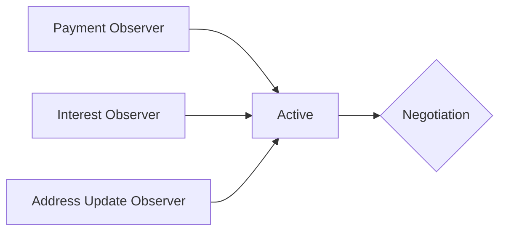

# Cardano-Loans

A p2p-DeFi lending/borrowing protocol with an on-chain credit history. Lenders and borrowers can
trustlessly negotiate all loan terms prior to initiating the loan. Once the loan starts, the
protocol will enforce all terms agreed upon during negotiations.

As with all [p2p-DeFi protocols](https://github.com/zhekson1/CSL-DeFi-Protocols), all users maintain
full custody, delegation control, and voting control of their assets at all times. No batchers are
required.

> Knowledge of basic Haskell syntax and `cardano-cli` usage is recommended. 

The Getting Started instructions can be found [here](./GettingStarted.md), and the benchmarks can
be found [here](./Benchmarks.md).

---
## Table of Contents
- [Abstract](#abstract)
- [Motivation](#motivation)
    - [Oracles](#oracles)
    - [Inefficient Markets](#inefficient-markets)
    - [No Trustless Composability with Other DApps](#no-trustless-composability-with-other-dapps)
    - [No Trustless Credit History](#no-trustless-credit-history)
    - [Centralized](#centralized)
- [The Cardano-Loans DeFi Protocol](#the-cardano-loans-defi-protocol)
    - [Supported Features](#supported-features)
- [Specification](#specification)
    - [The Borrower's Address](#the-borrowers-address)
    - [Proxy Script](#proxy-script)
    - [Telling Time](#telling-time)
    - [Protocol Phases and Beacons](#protocol-phases-and-beacons)
    - [Six Aiken Smart Contracts](#six-aiken-smart-contracts)
    - [Ask UTxOs](#ask-utxos)
        - [Creating Ask UTxOs](#creating-ask-utxos)
        - [Closing Ask UTxOs](#closing-ask-utxos)
        - [Updating Ask UTxOs](#updating-ask-utxos)
    - [Offer UTxOs](#offer-utxos)
        - [Creating Offer UTxOs](#creating-offer-utxos)
        - [Closing Offer UTxOs](#closing-offer-utxos)
        - [Updating Offer UTxOs](#updating-offer-utxos)
    - [Active UTxOs](#active-utxos)
        - [Accepting an Offer UTxO](#accepting-an-offer-utxo)
        - [Making a Loan Payment](#making-a-loan-payment)
        - [Applying Interest/Penalties](#applying-interestpenalties)
        - [Updating a Lender Address](#updating-a-lender-address)
        - [Claiming Expired Collateral](#claiming-expired-collateral)
        - [Unlocking Lost Collateral](#unlocking-lost-collateral)
    - [On-Chain Credit History](#on-chain-credit-history)
- [Benchmarks and Fee Estimations (YMMV)](#benchmarks-and-fee-estimations-ymmv)
- [Features Discussion](#features-discussion)
    - [On-Chain, Emergent Credit History](#on-chain-emergent-credit-history)
    - [Negotiable Collateralization](#negotiable-collateralization)
    - [Multi-Asset Loans](#multi-asset-loans)
    - [Staking Script Support](#staking-script-support)
    - [Endogenous Price and Interest Rate Discovery](#endogenous-price-and-interest-rate-discovery)
- [Future Considerations](#future-considerations)
    - [DID Compatibility](#did-compatibility)
    - [Term Extensions and Re-Negotiations](#term-extensions-and-re-negotiations)
    - [Linkable Credit Histories](#linkable-credit-histories)
    - [Version Compatibility for Negotiations](#version-compatibility-for-negotiations)
- [Conclusion](#conclusion)
    
## Abstract

Cardano-Loans is a *fully p2p* lending/borrowing protocol for the Cardano Settlement Layer (CSL). It
empowers users to create and operate a CSL-native credit-debt market via trustlessly negotiable and
enforcable p2p loans, and on-chain credit history. This circumvents the need for oracles and/or
concentrated lending pools in favor of *endogenous* price and interest-rate discovery. Users deploy
and interact with each others' script addresses; so full spending *and* delegation control of
assets are maintained, and contract upgrades occur democratically. This protocol natively supports
*all* Cardano assets as both loan assets and collateral assets - even assets that have yet to be
created.

## Motivation

A healthy credit-debt market is a vital, and often the largest, component of a thriving economy. A
healthy market is one in which prices reflect underlying reality as quickly and faithfully (ie, with
as little friction) as possible. For the sake of avoiding a whole treatise on economics, suffice to
say that *the best way to achieve fast and frictionless price discovery is through the aggregation
of maximally expressive individual sentiments.* This is especially true for credit-debt markets,
where money itself is the asset, priced via interest rates. Futhermore, as with all DeFi protocols,
any credit-debt market that seeks to be an alternative to the current global financial system will
likely be perceived as a threat by those in positions of high power, so censorship resistance is an
essential feature. 

Unfortunately, contemporary lending/borrowing DApps on Cardano are implemented in ways that cannot
possibly create a true trustless and decentralized credit-debt market. To fully appreciate this, it
is first important to understand the deficiencies of the status quo:

### Oracles

DApps that rely on off-chain information feeds are subject to the integrity of the underlying oracle
network. It is pretty easy to find examples of faulty oracle feeds causing DeFi issues that resulted
in users losing money. Not only that, but in many cases, *oracles are simply not necessary*. As long
as users are able to negotiate the terms *before* initiating the loan, there is no need for
liquidations, and therefore, no need for oracles. In TradFi, liquidations are usually only used
with *margin loans* which are typically short-term loans and/or are generally only used to buy more
securities (ie, speculate on markets). In a typical economy, most loans are *not* margin loans; you
wouldn't use a margin loan to start a business.

A lot of people believe oracles are required for DeFi because of the following:

> What if the value of the colleral falls 6 months into the loan?! Shouldn't Alice be forced to put
> up more collateral?

No, she shouldn't. Bob, her lender, knew the loan was going to be a year long loan. If he was
concerned about the value of the collateral falling during the life of the loan, he could have asked
for more collateral and/or asked for different collateral. The fact that cryptocurrency markets can
be extremely volatile does not matter. Volatile assets also exist in TradFi (eg, small cap stocks,
emerging market assets, etc), and this is one of the methods TradFi uses to manage the risk. If the
collateral ever falls too low, relative to the outstanding loan, **it is the lender's fault**. The
borrower should not be punished because the lender didn't properly manage the risk of a long-term
loan.

Allowing borrowers and lenders to directly negotiate entirely eliminates the need for oracles. This
dramatically minimizes the DApp's attack surface as well as makes the DeFi economy more independent.
Do we really want DeFi to rely on TradFi prices that are heavily influenced by central banks? Isn't
the point of DeFi to create an entirely independent economy, devoid of influence from those in
power? Any dependence on TradFi prices directly undermines this goal.

### Inefficient Markets

Not supporting direct negotiations also results in a very inefficient credit-debt market. 

"Efficiency" has a very different meaning to software developers and economists. In their quest for
efficiency as defined by software developers, contemporary DApp developers sacrifice the very thing
that makes something economically efficient: *the ability for users to explicity express their own
preferences.* If Cardano's DeFi **economy** is ever going to reach its full potential, DApp
developers need to start considering efficiency as defined by economists.

To take a direct quote from
[cardano-swaps](https://github.com/fallen-icarus/cardano-swaps#why-the-workarounds-for-the-issues-of-the-lp-based-architecture-are-not-sufficient):

> To quote [investopedia](https://www.investopedia.com/terms/p/pricediscovery.asp),  
> "The process of price discovery looks at a number of tangible and intangible factors, including
> supply and demand, investor risk attitudes, and the overall economic and geopolitical environment.
> Simply put, it is where a buyer and a seller agree on a price and a transaction occurs." There is
> fundamentally no way for algorithms that are based solely on supply and demand to properly reflect
> the true market sentiment. And when market sentiment cannot be accurately reflected, misallocation
> of resources is inevitable (ie, an unhealthy economy). 

Why is it that typical lending/borrowing DApps control every aspect of the loan: what asset can be
loaned out, what collateral can be used, what the interest rate will be, etc? This top-down control
of everything can only result in market inefficiencies. 

For example, what if there is less risk to lenders if a different loan asset is used? Perhaps a
stablecoin peg is getting weaker and so lenders would rather not use that stablecoin; they would
prefer to use another asset. Unfortunately, the new asset may not be supported by the DApp yet. This
means the credit-debt market could effectively come to a halt until after this gets sorted out, most
likely through a slow governance action. This same dilemma also exists if lenders are forced to use
one type of collateral over another.

Now consider interest rates. How is an algorithm, that is only based off of the current supply and
demand of a single liquidity pool, supposed to accurately set the interest rate for *all* loans? Why
should all loans even get the same interest rate? This notion is fundamentally absurd. When lenders
set interest rates, they consider several different factors. Here are just a few examples:

- The opportunity cost of using that money elsewhere (eg, investing it in the stock market)
- The risk of the borrower defaulting
- The time period of the loan (eg, 3 months vs 3 years)

Some of these factors are unique to the lender while others are unique to the borrower. For example,
perhaps Bob has another investment opportunity that could yield 8% APY for 3 years. Perhaps he would
still be willing to lend the amount to Alice, but only if she paid a 9% interest rate for the 3 year
loan. Now consider Alice's perspective as the borrower. If she has an exceptional, decade long
credit history, she is a very low default risk. Should she get charged the same interest rate as
Mike who only has 6 months of credit history? No, Alice should get a lower interest rate than Mike.
Alice could maybe even be allowed to put up less collateral than Mike since she is a lower risk of
default. None of the above factors are captured by an algorithm based soley on supply and demand.
This disconnect is guaranteed to cause market inefficiencies...

Furthermore, in order for a new asset to be made available as either the loan asset or a collateral
asset, new liquidity pools must be created with that asset. For some DApps, this requires a
"governance" action while others just require enough users to deposit the required assets into the
new pool. Either way, this is bad. Imagine if a new nation formed and created a new currency on
the blockchain. Either this new nation needs permission for its currency to join the DeFi ecosystem,
or it needs to be popular enough to attract enough capital to start a new liquidity pool. The former
gives incredible power to the gate keepers of new assets while the latter creates a chicken-or-egg
problem: the new currency will only be popular if it is useful for DeFi but it won't be useful for
DeFi unless it is actually listed from being popular. It shouldn't matter what any third-parties
think about an asset. If Alice wants to borrow the new nation's currency and Bob is willing to
lend it to her, why can't they use this currency? It shouldn't matter how many other people are
willing to use those assets.

Finally, **high TVL is a competition to see who can be most inefficient with DeFi capital.**
Capital-at-rest is wasted economic potential. A high TVL fundamentally means the supply is more than
the demand. The higher the TVL, the greater the disconnect between the supply and demand. This is a
huge misallocation of resources. If the DeFi economy is going to reach its full potential, **TVL
should be as low as possible.**

### No Trustless Composability with other DApps

DApp protocols that require users to go through batchers will never be as trustlessly composable as
fully p2p protocols. The argument was already made in the cardano-swaps
[README](https://github.com/fallen-icarus/cardano-swaps#why-the-workarounds-for-the-issues-of-the-lp-based-architecture-are-not-sufficient)
so it will just be quoted here (reformatted for readability):

> Since LPs require going through middle-men, the ultimate transaction for Alice will likely not
> even be seen by Alice prior to submission to the blockchain. How can Alice express that she wants
> her swap composed with an options contract and expect it to be trustlessly executed? How can Bob
> also do this? Finally, how can the smart contracts enforce that *both* Alice's and Bob's
> compositions are properly executed when their requests are batched together? 
>
> This is not an issue of standards; this is an issue of whether or not the required composition
> logic can even fit in a transaction where other DApp logic is being executed. The only way for the
> composition to be trustless is if smart contracts enforce it. To put it concretely, in Alice's
> composition, the swap logic and the options logic must both be executed in the same transaction
> where the composition logic is executed. Given the very small amount of execution units available
> to scripts in a transaction, is there even room for this extra logic? 
>
> The composition logic requires two things: it must support *arbitrary* compositions and it must be
> extremely cheap since the logic of the actual DApps being composed must also be executed in the
> same transaction. *p2p protocols do not have the same limitations since Alice personally creates
> and signs her own transaction.* The above two requirements are only requirements when middle-men
> are creating and executing transactions on the behalf of users. 
>
> Even if some composition logic could fit in the transaction, would it actually support arbitrary
> composition (as opposed to only a few priviledged DApps being supported)? Even if the answer to
> this question is yes, that extra logic being executed means less space for other DApps to compose
> in the transaction. Therefore, protocols that require batchers will never be able to offer the the
> same level of trustless composition as fully p2p protocols. 
>
> The only way to actually match the level of composition of p2p protocols is for the batcher based
> composition to *not be trustless* (without the composition logic, more DApps can fit in a
> transaction).

*Not supporting composability can have serious economic consequences.* As you'll soon see,
Cardano-Loans allows borrowers to make payments directly to a lender's personal address, and each
lender gets an NFT that acts as the bond for that loan. Lenders can freely trade this bond, and
whoever controls the bond can change the address borrowers must make payments to.

Imagine if Bob lent 1000 ADA to Alice for 1 year; Bob now has the bond NFT associated with this
loan. A few months go by and Alice has paid back 200 ADA, leaving 800 ADA still due. Unfortunately
for Bob, his business has hit some financial trouble and he needs to liquidate some assets in
order to cover its expenses. So he looks to sell the bond NFT for Alice's loan on the secondary
market, a separate DApp. How much should he expect to get from this sale? If the owner held it to
"maturity", they *should* be able to get 800 ADA from owning it; but after factoring in the
time-value of money, perhaps 700 ADA is a realistic sale price. It is a 12.5% haircut just to be
able to get some liquidity out right now.

Imagine Mike sees Bob's bond NFT on sale for 700 ADA. Would he take this deal? Ultimately, it comes
down to whether or not Mike can change the required payment address for future loan payments
*before* Alice makes any new payments on the loan. Without composability, Mike would have to buy the
bond NFT in one transaction, and then update the lender address in a second transaction. What would
happen if Alice fully paid off the loan *between* these two transactions? Mike would have paid 700
ADA to Bob, and Bob still would have gotten the 800 ADA from the loan. Mike would have spent 700 ADA
and gotten nothing out of it! If Mike is unable to buy the bond NFT in the same transaction where he
updates the payment address, there is a huge risk that Mike will end up with nothing! Factoring in
this risk, perhaps Mike is only willing to pay 200 ADA for Bob's bond NFT. If Bob accepted this, he
would lose 75% of the bond NFT's value just to liquidate it now! There is a very high probability
that 1 bond NFT would not be enough to save Bob's business; he would either have to sell more bond
NFTs at a 75% discount or close his business. If the latter happens, it could start an economic
cascade where other businesses are forced to liquidate only to immediately lose 75% of their assets'
market values. **This is an economic recession in the making.**

But what if Mike actually could buy the bond NFT in the same transaction where he updates the
payment address? In practice, this means Mike would submit a transaction to buy a bond NFT from a
specific UTxO *and* to update the payment address for Alice's loan which is located at another UTxO.
If Alice makes another payment on the loan before Mike's transaction is processed, Alice's loan is
no longer located at that UTxO (she spent it in order to update the state of the loan); Mike's
transaction would be guaranteed to fail. And since the transaction failed due to the UTxO being
spent, no smart contracts would be executed which means Mike's collateral would be safe. If Mike's
transaction gets processed before Alice's next payment, Alice's next loan payment is guaranteed to
go to Mike (Cardano-Loans will enforce the payment goes to the new address). *Composability
**guarantees** that Mike will only buy the bond NFT if all future loan payments go to him.* Since
Mike is not exposed to the huge risk in the non-composable scenario, Mike would likely be more than
happy to buy the bond NFT from Bob at a sale price of 700 ADA. This one sale is the equivalent of
3.5 sales in the non-composable scenario. Bob is way more likely to be able to raise enough money to
keep his business running! There is far less risk of an economic recession with this scenario. And
it is all thanks to being able to compose DeFi protocols.

DApp composability isn't just about risk-management, it is also one of the killer features of eUTxO
blockchains. You can execute 15 different smart contracts in a single Cardano transaction; this
probably equates to 5-7 different DApps being executed in this single transaction. This
composability enables things in DeFi that people in TradFi can only dream about. Consider the
example of converting DJED to ADA to buy an options contract on the secondary market only to
immediately execute it; this all takes place in a single transaction.

How would you do the above composition in TradFi? Just the first step of converting DJED to ADA
would likely require a few days for the trade to settle. In the meantime, you are exposed to the
volatility of ADA. Then, if your broker doesn't support the secondary market, you need to transfer
your ADA to another broker which would take another few days to settle. Buying the options contract
may take ANOTHER few days to settle. Do you see where this is going? By the time all of the settling
has finished, the opportunity may have long passed.

While the above example doesn't include Cardano-Loans, the point is that composition allows for
creating truly complex economic transactions from very simple building blocks. Just like with
Wolfram's cellular automaton, it is very hard to predict what the ultimate economy will look like.
Because of this, **all core DeFi DApps should priortize composability**. People may come up with
useful compositions that the DApp developers never considered. The more compositions that are
possible, the larger, and more complex the DeFi economy can become. And as the risk-management
example shows, composability can make the complex DeFi economy more resilient.

### No Trustless Credit History

You simply cannot have a healthy credit-debt market without credit history. However, if a market
does have credit history but that history is not trustless, it just creates another attack vector
governments and hackers can use to target the growing DeFi economy. 

Some DApps try to rely on off-chain credit history databases, but this is not a good approach.
*Reading* credit histories must be just as trustless as *writing* credit histories. Even if the
blockchain records the credit history trustlessly, if lenders can't query the credit history, it is
effectively the same as there being no credit history. A centralized database, or a database that is
hard to read, is easy to commandeer/censor. 

In practical terms, if only beefy computers are able to read the credit histories from the
blockchain, those with these computers are in a priviledged position between borrowers and lenders.
They can deny sharing the credit histories for borrowers they don't like. This would effectively
nullify a borrower's entire credit history since lenders will most likely treat an unknown history
the same as no history. This same method can even be used to censor borrowers they *do* like since
the unknown credit history will scare away competing lenders.

Furthermore, even if the people with these beefy computers are honest, they are a very centralized
group that may be easy for governments to target. If a government is able to commandeer these beefy
computers, governments will still be able to exert undue influence. Blockchain would fail to be a
check on government abuse. This argument applies to proprietary credit history databases as well.

Credit histories *must* be on-chain and *must* be easy to lookup, even with an average computer.
Otherwise, the credit history database itself would be an existential risk for a DeFi credit-debt
market.

> NOTE: Data availability is still a work in progress, but so far, there are no alternatives to
> storing the critical information on-chain. There may never be an alternative; the whole point of
> the layer 1 chain is to create a global database of critical information. Custody of money is
> *not* the only critical information an economy relies on.

### Centralized

Contemporary lending/borrowing DApps use liquidity pools which means users must sacrifice custody,
delegation control, and voting control of their assets in order to participate in DeFi. As these
DApps gain adoption, the underlying Cardano blockchain becomes less decentralized and secure.

Furthermore, despite issuing "governance tokens", most of these DApps are controlled by nothing more
than a multisig. The DApp developers have the ability to freeze all market activity. The claim is
that these DApps will eventually be decentralized, but it remains to be seen if this is even
possible with their designs. Most layer 1 blockchains are still struggling to achieve
decentralization (it is a very hard problem). In the meantime, it is trivial for governments and
hackers to target these DApps since they only really need to target the multisig key holders.

Malicious actors are not the only risk to DeFi: regulations are also an existential risk since they
are another way for governments to exert influence on the DeFi economy. The regulatory landscape is
still changing, but they all center around whether the DApp is actually decentralized ([Europe
example](https://cointelegraph.com/news/upcoming-defi-rules-europe-could-ban-non-decentralized-protocols)).
If there is even a single centralization bottleneck (eg, closed-source smart contracts, permissioned
batchers, minting of yield tokens, multisig control, etc), the entire DApp can be regulated. If a
DApp is truly decentralized, it should be *legally unregulatable*.

Not all blockchain applications need to be decentralized, but core DeFi functionality *definitely
needs to be decentralized.* 

## The Cardano-Loans DeFi Protocol

Cardano-Loans addresses all of the above limitations by creating a truly bottom-up and endogenous
credit-debt market for Cardano. By allowing direct negotiations between borrowers and lenders, this
market is theoretically as efficient as possible, without needing to rely on oracles. It achieves
all of this while still being natively composable with other DeFi DApps, and being maximally
decentralized and censorship resistant.

### Supported Features

- **Cryptographically-Protected & Trustless On-Chain Credit History** - a borrower's history is
directly recorded on-chain and it is 100% controlled by the protocol. *It is impossible for
borrowers to lie about their credit history.* Futhermore, identity theft is also impossible. For the
first time ever, the non-banked can start building a credit history that is globally accessible and
verifiable.
- **Native Support for All Assets** - all assets are directly supported as loan assets and
collateral assets. Nobody needs to ask permission to use a new asset. Even if only 10 people in the
world are willing to use an asset, no one can stop them. 
- **Multi-Collateral Loans** - borrowers can use a basket of assets as collateral for a loan.
Furthermore, *there is no limit to the number of assets a borrower can use as collateral for a
loan.*
- **Interest-Free, Non-Compounding, or Compounding Interest** - lenders and borrowers have full
flexibility over what the interest for the loans will be. They can even decide on what the
compounding frequency will be.
- **Naturally Incentivized Regular Payments** - borrowers are incentivized to make regular payments
on loans to avoid penalties agreed upon during negotiations. Because of this, lenders may be more
willing to lend since there will be more regularity in when they will receive payments. This
regularity can help them manage risk.
- **Direct Loan Payments to Lenders** - borrowers make each loan payment directly to the address
specified by the lender. This means lenders don't need to wait until the end of the loan to claim
the proceeds from each payment.
- **Tradable Bonds** - when a borrower accepts an offer from a lender, the lender recieves an NFT
that reflects ownership of the loan. In the case of a default, whoever owns this NFT is able to
claim the remaining collateral. Furthermore, the owner of this NFT is able to update the required
payment address for the loan, even after it has started. This NFT is effectively the loan bond that
can be freely traded on a secondary market.
- **Over-Collateralized, Under-Collateralized, or Fully-Collateralized Loans** - lenders and
borrowers can set the relative values of the collateral assets to anything they want. If they set
the relative values above the market price, that is an over-collateralized loan; at the market price
would be a fully-collateralized loan; and below the market price would be an under-collateralized
loan. If lenders think the value of the collateral will change over the course of the loan's
lifetime, they can set the relative values in such a way to minimize this risk.
- **A Single DApp Address for each Borrower** - every borrower gets their own personal DApp address.
All negotiations involving the borrower take place in this address and all active loans live in this
address. This makes it very easy for front-ends to integrate Cardano-Loans as well as for borrowers
to manage the stake/voting power for assets in the DApp.
- **Efficient Off-chain Sorting of Loans** - by using beacon tokens, users can easily query the
protocol for any information they may want. These beacon queries can even be combined to create more
complicated queries. For example, lenders can see all current Asks and optionally filter them by
loan asset and/or offered collateral. It is even possible to query a loan's entire event history.
- **Democratic Upgradability** - users decide if and when to upgrade to a new version of the DApp.
No one can decide this for them, or force them to move to a new version (eg, by freezing all
functionality for the current version).
- **Full Composability** - this protocol is natively composable with all other DeFi DApps. It can
even be composed with itself: a borrower can accept an offer in the same transaction where they make
a payment.

## Specification

This section is the low-level specification for the protocol. If you are only interested in the
high-level aspects, feel free to skip to the next [section](#benchmarks-and-fee-estimations-ymmv).

### The Borrower's Address

Borrowers each create a unique "loan" address - this is where all negotiations take place *and*
where all collateral is kept until the loan is either repaid or expired. As is common in
*distributed dApps*, all such loan addresses use the same validator script for the payment
credential, and a unique, user-defined staking key or script for the staking credential.
Owner-related actions are delegated to the staking credential *by* the validator script, so the user
maintains full custody of all assets at the address. The borrower's credit history is
cryptographically tied to the staking credential used in the loan address.

Since negotiations occur in the borrower's address, the borrower maintains staking and voting rights
over all assets throughout the life cycle of the loan. This includes collateral, which makes sense,
since collateral belongs to the borrower until they default. It also includes any assets attached to
offers, which incentivizes lenders to be proactive and not leave offers open for too long. 

> :warning: If, at any point, a misconfigured UTxO is sent to a borrower's address, the borrower
> will get custody. Such UTxOs can only come about by misusing the DApp.

### Proxy Script

Since Cardano-Loans has borrowers make payments directly to lenders, care must be taken when the
lender's address uses a payment plutus script. This is because the protocol enforces a specific
datum with loan payments in order to guarantee uniqueness of outputs - this is currently the
cheapest option for preventing double satisfaction. If the loan payments with this enforced datum
are sent to a lender's address that requires a different datum, the loan payment can be locked
forever.

To address this issue, Cardano-Loans supports a pre-approved proxy script to trustlessly enable
arbitrary logic for lender addresses without compromising security and composition. The proxy script
can accept any datum, use any redeemer, and simply delegates spending authorization to the address'
staking credential, which can be anything (eg, a native script, a plutus script, or even a pubkey).

Payment pubkey address are always allowed since they can accept any datum. The proxy script is only
necessary if the lender wishes to use more than just a single pubkey to protect their assets. For
example, if the lender wishes to use a multisig, they would use the proxy script as the payment
credential and the native multisig script as the staking credential for their lender address. If the
lender wanted more complicated logic to protect their assets, they would use the proxy script as the
payment credential and a plutus script as the staking credential. *The proxy script must always be
paired with a staking credential.* The protocol will disallow any proxy scripts used without a
staking credential.

This proxy script can be used for *all* DeFi protocols that wish to enable direct payments to users.

### Telling Time

Time is a critical part of loans so how does Cardano-Loans tell time? The answer is quite simple:
use the validity intervals for transactions. Ultimately, the protocol does *not* need to know the
current time; it only needs to know whether a certain time has, or has not, passed.

This is where the validity intervals come in. A smart contract will only ever be run if the validity
interval is true. Therefore, if the `invalid-before` is set to slot 10 and the smart contract is being
executed, then the smart contract knows that slot 10 is guaranteed to have already passed. Likewise,
if the `invalid-hereafter` is set to slot 20 and the smart contract is being executed, then the smart
contract knows that slot 20 has definitely *not* passed yet.

Therefore, this protocol uses the following general rules:
- If you need to prove to the smart contract that time `y` has passed, set the `invalid-before` bound
to `y`.
- If you need to prove to the smart contract that time `x` has *not* passed yet, set the
`invalid-hereafter` bound to `x`.

### Protocol Phases and Beacons

All actions are largely categorized into two broad phases:

1. *Negotiation Phase* - this is when borrowers ask for a loan, lenders make offers, and
   negotiations happen. It ends when either the borrower and lender go their separate ways, or a
borrower accepts a lender's offer.
2. *Active Phase* - this phase starts when a borrower accepts a lender's offer. During this phase,
   the protocol will enforce all terms agreed upon during the negotiation phase.

#### Phase UTxOs

Further dividing the protocol's phases, each phase separates "states" into dedicated UTxO types.

- *Ask UTxO* - this negotiation phase UTxO is created by the borrower. It contains a datum with the
borrower's desired terms and beacon tokens to broadcast it to other users. Ask UTxOs are always
stored in the corresponding borrower's DApp address.
- *Offer UTxO* - this negotiation phase UTxO is created by the lender. It contains a datum with the
lender's desired terms and beacon tokens to broadcast it to other users. Offer UTxOs are always
stored in the corresponding borrower's DApp address. One of the beacons attached to the Offer UTxO
is strictly so that the associated lender can find it, despite it being in another user's address.
- *Active UTxO* - this active phase UTxO is the actual loan. It exists in the borrower's DApp
address, and holds the collateral for the loan as well as the current state of the loan. Each Active
UTxO contains a unique ID, and one of the beacon tokens attached to this UTxO is strictly to make it
easy to find this specific loan UTxO, off-chain.

The Active UTxOs can be further sub-divided into 3 types:

- *Live* - this Active UTxO is for a loan that is still active and being paid off.
- *Expired* - this Active UTxO is for a loan that has expired before fully being repaid. It is
waiting for a lender to claim the collateral.
- *Lost* - this is an Expired Active UTxO that has been waiting around long enough for the protocol
to consider it lost. In order to prevent permanent locking of assets in the event the associated
bond NFT is lost, the protocol allows the borrower to claim the collateral attached to this UTxO.
The time until the protocol considers an Expired Active UTxO "lost" is one of the negotiable loan
terms.

#### Ask UTxO Beacons

Ask UTxOs have two dedicated beacons:

- *Ask Beacon* - a negotiation beacon token representing an Ask UTxO. It has the token name "Ask"
(converted to hexidecimal).
- *Loan Asset Beacon* - a negotiation beacon token representing which asset is the desired loan
asset. It has the token name: `sha2_256("Asset" ++ asset_policy_id ++ asset_token_name)`.

Each Ask UTxO must be store with at least 1 unit of each asset offered for collateral. While not
technically beacon tokens, these assets can compliment the other beacons by enabling the filtering
of Ask UTxOs by those offering specific assets as collateral.

#### Offer UTxO Beacons

Offer UTxOs have three dedicated beacons:

- *Offer Beacon* - a negotiation beacon token representing an Offer UTxO. It has the token name
"Offer" (converted to hexidecimal).
- *Loan Asset Beacon* - a negotiation beacon token representing which asset is the offered loan asset.
It has the token name: `sha2_256( "Asset" ++ asset_policy_id ++ asset_token_name )`.
- *Lender ID Beacon* - a negotiation beacon token representing the lender this offer belongs to. It
has the token name: `sha2_256( prefix ++ lender_staking_credential_hash)` where `prefix` is either
`00` or `01` if the lender's credential is a pubkey credential or script credential, respectively.

#### Active UTxO Beacons

Active UTxOs have four dedicated beacons:

- *Active Beacon* - an active beacon token representing an Active UTxO. It has the token name
"Active" (converted to hexidecimal).
- *Loan Asset Beacon* - an active beacon token representing which asset is the offered loan asset.
It has the token name: `sha2_256( "Asset" ++ asset_policy_id ++ asset_token_name )`.
- *Borrower ID Beacon* - an active beacon token representing the borrower this loan is for. Its
token name is the borrower's staking credential hash (the same credential used in the borrower's
DApp address).
- *Loan ID Beacon* - an active beacon token uniquely representing this Active UTxO. Its token name
is:  `sha2_256( offer_utxo_tx_hash ++ offer_utxo_output_index )`. There are two of these for each
loan, one is stored with the collateral and one is the NFT that can be freely traded among lenders.

The Loan Asset Beacon names for the negotiation phase and active phase are deliberately the same to
simplify the off-chain querying.

The borrower's credit history is directly tied to what happens with the Borrower ID Beacon.

The two Loan ID Beacons act as *Lock & Key NFTs*. One copy is *always* stored with the collateral
while the other is the bond NFT given to the lender. Whenever the lender wants to do something (eg,
update the payment address or claim expired collateral), the transaction must contain *both* copies.
Because of this, the Key NFT can act as a proxy for the lender's approval of the action; the Key NFT
can only move to a new output or be burned if the owner approved the transaction. Furthermore, it is
trivial for lenders to look up the current state of the loan stored with the Lock NFT since it will
have the same name as the Key NFT.

### Six Aiken Smart Contracts

Due to the amount of logic required for this protocol and the desire to minimize the impact from
redundant executions, this protocol uses 6 separate smart contracts; *not all of them are required
with each transaction*. Each smart contract is dedicated to a specific purpose. As a consequence of
this, there are actually two separate minting policies for beacon tokens: one for negotiation phase
beacons and one for active phase beacons. Most user actions only required 2 of the 6 contracts in a
single transaction. The most that is ever needed is 3 out of the 6 contracts. However, since these
scripts can be used as reference scripts, there is still plenty of room for DApp composability.

- *Negotiation Smart Contract* - this smart contract is in charge of minting/burning beacons for the
negotiation phase of the protocol. In addition to being a minting policy, it can also be executed as
a staking script to enable cheaply updating Ask and Offer UTxOs in-place (ie, no beacons need to be
minted/burned, but the new datums need to be checked).
- *Active Smart Contract* - this smart contract is in charge of minting/burning beacons for the
active phase of the protocol. It can only be executed as a minting policy.
- *Payment Observer Smart Contract* - this smart contract is in charge of observing all loan
payments. It can only be executed as a staking script.
- *Interest Observer Smart Contract* - this smart contract is in charge of observing all
interest/penalty applications. It can only be executed as a staking script.
- *Address Update Observer Smart Contract* - this smart contract is in charge of observing all
lender payment address updates. It can only be executed as a staking script.
- *Loan Spending Smart Contract* - this smart contract is the payment credential for *all* DApp
addresses. It delegates checks to one of the other 5 smart contracts depending on the action being
taken. It can only be executed as a spending script.

The loan spending smart contract hash is hard-coded into *all* of the other smart contracts to
enforce the use of the proper payment credential for all borrower addresses.

All of the observer smart contract hashes are hard-coded into the active smart contract so that the
active smart contract can force the use of the proper observer logic. Then, the active smart
contract hash is hard-coded into the negotiation smart contract so that the negotiation smart
contract can force the use of the proper active smart contract. The active smart contract hash
embodies the observer hashes hard-coded into it so there is no need to also hard-code the observer
hashes into the negotiation smart contract. It looks like this:



The protocol's complementary proxy smart contract is hard-coded into the address update observer
smart contract and the negotiation smart contract so that lender payment addresses can be checked
for proper configurations. **If any smart contract has the wrong hashes hard-coded, the beacons
will be different and these UTxOs will be invisible to users using the correct beacons.**

The redeemers and datums are introduced here:

#### Negotiation Smart Contract Redeemers
```haskell
data NegotiationBeaconsRedeemer
  -- | Create, close, or update some Ask UTxOs (1 or more). The credential is the borrower's
  -- staking credential that is used for the DApp address and the Borrower ID.
  = CreateCloseOrUpdateAsk { borrowerStakeCredential :: Credential }
  -- | Create, close, or update some Offer UTxOs (1 or more). The credential is the lender's
  -- staking credential that is used for the Lender ID.
  | CreateCloseOrUpdateOffer { lenderStakeCredential :: Credential }
  -- | Burn any beacons. This can only be used in the same transaction where CreateActive is used
  -- for the active beacon script.
  | BurnNegotiationBeacons
  -- | Register the script for staking execution. This redeemer can only be used with a certificate
  -- execution.
  | RegisterNegotiationScript
```

#### Active Smart Contract Redeemers
```haskell
data ActiveBeaconsRedeemer
  -- | Create some Active UTxOs (1 or more) for the borrower. The CurrencySymbol is the 
  -- policy id for the negotiation beacons. The loan spending script will force the proper
  -- policy id to be passed in with the redeemer. This allows the loan spending script to get the
  -- negotiation policy id from the input's datum (which was already validated) and give it to 
  -- the active smart contract.
  = CreateActive { negotiationPolicyId :: CurrencySymbol }
  -- | Burn the lock and key NFT to claim expired collateral attached to the associated lock NFT.
  | BurnKeyAndClaimExpired
  -- Burn all remaining beacons and claim "Lost" collateral. 
  | BurnAndUnlockLost
  -- | Burn any beacons. This is only ever used in transactions with full payments.
  | BurnActiveBeacons
```

#### Payment Observer Smart Contract Redeemers
```haskell
data PaymentObserverRedeemer
  -- | Observer a borrower's loan payment transaction. It will validate all inputs spent using the
  -- MakePayment spending redeemer.
  = ObservePayment
  -- | Register the script for staking execution. This can only be used with a certificate
  -- execution.
  | RegisterPaymentObserverScript
```

#### Interest Observer Smart Contract Redeemers
```haskell
data InterestObserverRedeemer
  -- | Observer a borrower's loan interest application transaction. It will validate all inputs
  -- spent using the ApplyInterest spending redeemer.
  = ObserveInterest
  -- | Register the script for staking execution. This can only be used with a certificate
  -- execution.
  | RegisterInterestObserverScript
```

#### Address Update Observer Smart Contract Redeemers
```haskell
data AddressUpdateObserverRedeemer
  -- | Observer a lender's address update transaction. It will validate all inputs spent using the
  -- UpdateLenderAddress spending redeemer.
  = ObserveAddressUpdate
  -- | Register the script for staking execution. This can only be used with a certificate
  -- execution.
  | RegisterAddressUpdateObserverScript
```

#### Loan Spending Smart Contract Redeemers
```haskell
data LoanRedeemer
  -- | Close or update an Ask UTxO.
  = CloseOrUpdateAsk
  -- | Close or update an Offer UTxO.
  | CloseOrUpdateOffer
  -- | Convert an Ask UTxO and an Offer UTxO into an Active UTxO.
  | AcceptOffer
  -- | Make a payment on a loan. The amount is the size of the payment made for this loan.
  | MakePayment { paymentAmount :: Integer }
  -- | Apply interest to this loan N times and deposit the specified amount of ada if needed for the
  -- minUTxOValue.
  | ApplyInterest { depositIncrease :: Integer, numberOfTimes :: Integer }
  -- | Claim collateral for an expired loan using the Key NFT.
  | SpendWithKeyNFT
  -- | Update the address where loan payments must go. Optionally deposit additional ada if needed
  -- for the minUTxOValue.
  | UpdateLenderAddress { newAddress :: Address, depositIncrease :: Integer }
  -- | Clean up remaining beacons from Lost Active UTxOs and claim the attached collateral.
  | Unlock
  deriving (Generic,Show)
```

#### Loan Spending Smart Contract Datums

A DApp UTxO's datum can either be an `AskDatum`, an `OfferDatum`, or an `ActiveDatum`. All datums
must be inline datums.  

`POSIXTime` is always in milliseconds.

```haskell
-- | A type synonym for an asset's full name.
type Asset = (CurrencySymbol,TokenName)

-- | The penalty to apply whenever the minimum payment is not met in a given loan epoch.
data Penalty
  = NoPenalty
  | FixedFee Integer
  | PercentFee Rational

data LoanDatum 
  = AskDatum
      -- | The policy id for the negotiation beacon script.
      { negotiationBeaconId :: CurrencySymbol
      -- | The policy id for the active beacon script.
      , activeBeaconId :: CurrencySymbol
      -- | The borrower's staking credential hash as a token name.
      , borrowerId :: TokenName
      -- | The asset to be loaned out.
      , loanAsset :: Asset
      -- | The token name for the loan asset beacon.
      , assetBeacon :: TokenName
      -- | The size of the loan.
      , loanPrincipal :: Integer
      -- | The desired duration of the loan.
      , loanTerm :: POSIXTime
      -- | The assets that can used as collateral.
      , collateral :: [Asset]
      }
  | OfferDatum
      -- | The policy id for the negotiation beacon script.
      { negotiationBeaconId :: CurrencySymbol
      -- | The policy id for the active beacon script.
      , activeBeaconId :: CurrencySymbol
      -- | The prefixed lender's staking credential hash as a token name.
      , lenderId :: TokenName
      -- | The lender's payment address.
      , lenderAddress :: Address
      -- | The asset to be loaned out.
      , loanAsset :: Asset
      -- | The token name for the loan asset beacon.
      , assetBeacon :: TokenName
      -- | The size of the loan.
      , loanPrincipal :: Integer
      -- | The frequency at which interest must be applied and/or penalties applied.
      , epochDuration :: Maybe POSIXTime
      -- | The duration of the loan.
      , loanTerm :: POSIXTime
      -- | The interest that must be periodically applied.
      , loanInterest :: Rational
      -- | Whether the interest is compounding.
      , compoundingInterest  :: Bool
      -- | The minimum amount that must be paid each loan epoch.
      , minPayment :: Integer
      -- | The penalty that gets applied if the minimum payment has not been met this loan epoch.
      , penalty :: Penalty
      -- | The relative values of the collateral assets. The prices are always
      -- collateralAssetUnits / loanAssetUnits.
      , collateralization :: [(Asset,Rational)]
      -- | Whether collateral can be swapped out for other collateral during a loan payment.
      , collateralIsSwappable :: Bool
      -- | How long the lender will have to claim the defaulted UTxO. Once this time passes,
      -- the protocol will consider the Active UTxO "lost".
      , claimPeriod :: POSIXTime
      -- | How much ADA was used for the UTxO's minUTxOValue. This will be returned to the lender
      -- when the borrower accepts the loan.
      , offerDeposit :: Integer
      -- | An optional offer expiration time.
      , offerExpiration :: Maybe POSIXTime
      }
  | ActiveDatum
      -- | The policy id for the active beacon script.
      { activeBeaconId :: CurrencySymbol
      -- | The hash for the payment observer script.
      , paymentObserverHash :: ScriptHash
      -- | The hash for the interest observer script.
      , interestObserverHash :: ScriptHash
      -- | The hash for the address update observer script.
      , addressUpdateObserverHash :: ScriptHash
      -- | The borrower's staking credential hash as a token name.
      , borrowerId :: TokenName
      -- | The lender's payment address.
      , lenderAddress :: Address
      -- | The asset to be loaned out.
      , loanAsset :: Asset
      -- | The token name for the loan asset beacon.
      , assetBeacon :: TokenName
      -- | The size of the loan.
      , loanPrincipal :: Integer
      -- | The frequency at which interest must be applied and/or penalties applied.
      , epochDuration :: Maybe POSIXTime
      -- | The last time interest/penalty was applied.
      , lastEpochBoundary :: POSIXTime
      -- | The duration of the loan.
      , loanTerm :: POSIXTime
      -- | The interest that must be periodically applied.
      , loanInterest :: Rational
      -- | Whether the interest is compounding.
      , compoundingInterest  :: Bool
      -- | The minimum amount that must be paid each loan epoch.
      , minPayment :: Integer
      -- | The penalty that gets applied if the minimum payment has not been met this loan epoch.
      , penalty :: Penalty
      -- | The relative values of the collateral assets. The prices are always
      -- collateralAssetUnits / loanAssetUnits.
      , collateralization :: [(Asset,Rational)]
      -- | Whether collateral can be swapped out for other collateral during a loan payment.
      , collateralIsSwappable :: Bool
      -- | The time at which the lender's claim period will expire and the Active UTxO will be
      -- considered "lost".
      , claimExpiration :: POSIXTime
      -- | The time at which the loan will expire.
      , loanExpiration :: POSIXTime
      -- | The loan's remaining unpaid balance.
      , loanOutstanding :: Rational
      -- | The total payments made this loan epoch.
      , totalEpochPayments :: Integer
      -- | The loan's unique indentifier. This is the name of the loan's Lock & Key NFTs.
      , loanId :: TokenName
      }
```

#### Payment Datum

This inline datum is attached to all direct outputs to lenders. It is used to prevent
double-satisfaction.

```haskell
-- | The `CurrencySymbol` is always the active beacon policy id, and the `TokenName` is always
-- the Loan ID this payment output corresponds to.
newtype PaymentDatum = PaymentDatum (CurrencySymbol,TokenName)
```

The `CurrencySymbol` is included to prevent double-satisfaction during DApp composition; just using
the `TokenName` may not be enough to guarantee uniqueness.

### Ask UTxOs

Borrowers begin negotiations by creating a new Ask UTxO with their desired terms at their loan
address. The borrower is able to create/update/close multiple Ask UTxOs in a single transaction;
each Ask UTxO created/updated/closed can have different terms.

#### Creating Ask UTxOs

At a high-level, creating Ask UTxOs involves creating Ask UTxO outputs with the desired `AskDatum`s
at a specific borrower's address, and tagging them with the required beacons so that they will be
broadcast to potential lenders. The borrower must approve this action.

At a low-level, in order to successfully create an Ask UTxO, all of the following must be true:

- The negotiation beacon smart contract must be executed as a minting policy using
`CreateCloseOrUpdateAsk`.
- The staking credential used with the `CreateCloseOrUpdateAsk` redeemer must be the one used for
the Borrower ID *and* the target loan address.
- All outputs with beacons must have exactly two kinds of beacons, with exactly one unit of each:
    - an Ask beacon with the token name "Ask" (converted to hexidecimal)
    - a loan asset beacon with the token name corresponding to this Ask's loan asset.
- All outputs with beacons must have a valid inline `AskDatum`:
    - `negotiationBeaconId` == the negotiation smart contract policy id
    - `activeBeaconId` == the negotiation smart contract's hard-coded active smart contract hash
    - `borrowerId` == the staking credential hash used in the `CreateCloseOrUpdateAsk` redeemer
    - `loanAsset` == asset that corresponds to the loan asset beacon in this output
    - `assetBeacon` == this output's loan asset beacon's token name
    - `loanPrincipal` > 0
    - `loanTerm` > 0
    - `collateral` must not be empty, must be sorted lexicographically, and must *not* have any
    duplicates
- All outputs with beacons must contain at least one unit of each asset in the collateral list.
- All outputs with beacons must not have any extraneous assets (ada is always allowed).
- All outputs with beacons must go to the loan address using the same staking credential as the one
in the `CreateCloseOrUpdateAsk` redeemer.
- The staking credential in the `CreateCloseOrUpdateAsk` redeemer must approve the transaction.

One unit of each asset in the collateral list must be stored in the Ask UTxO to allow the lender to
potentially filter Ask UTxOs based off the loan asset and/or a desired collateral asset. In other
words, the collateral itself can compliment the beacon queries. This requirement also has the added
benefit of preventing denial-of-service attacks against the beacon queries by: 1) invalidating Ask
UTxOs with fake collateral assets, and 2) pushing up the required minUTxOValue for each Ask UTxO.
The minUTxOValue makes it expensive to create millions of Ask UTxOs with real but worthless
collateral just to pollute the beacon queries.

All assets the borrower is willing to use as collateral *must* appear in the `collateral` list. The
borrower does not need to use that asset as collateral, but *assets not found in the `collateral`
list cannot be used as collateral for a loan*.

A consequence of these requirements is that all Ask UTxOs created *must* be for the same borrower.

The borrower's credential must signal approval so that only that borrower can initiate negotiations
under that identity. This helps cryptographically prevent identity theft.

The loan asset is deliberately allowed to be the same as a collateral asset to enable secured loans.
Secured loans are very useful for bootstrapping a borrower's credit history. You can read more about
how TradFi uses secured loans [here](https://www.investopedia.com/terms/s/securedcard.asp).

There is no need for the `AskDatum` to contain the observer scripts since the observer script hashes
are hard-coded into the active beacon script. Therefore, the active beacon script hash implicitly
also declares what observer scripts are allowed to be used.

#### Closing Ask UTxOs

At a high-level, closing Ask UTxOs involves spending the Ask UTxOs and burning all beacons attached
to them. The borrower must approve this action.

At a low-level, all of the following must be true:

- The loan spending smart contract is executed for the Ask UTxO input using `CloseOrUpdateAsk`.
- The Ask UTxO must have an `AskDatum`.
- If the Ask UTxO being spent contains beacons:
    - The negotiation beacon smart contract must be executed as a minting policy using
    `CreateCloseOrUpdateAsk`.
    - The staking credential used with the `CreateCloseOrUpdateAsk` redeemer must be the one used
    for the Borrower ID *and* the target loan address.
    - The staking credential in the `CreateCloseOrUpdateAsk` redeemer must approve the transaction.
- If the Ask UTxO *does not* contain beacons, then the loan address' staking credential must signal
approval.

The negotiation smart contract will actually do the exact same check as when creating Ask UTxOs.
However, since closing Ask UTxOs implies no new Ask UTxO outputs, there are no outputs to check.

If there is ever an invalid Ask UTxO (ie, an Ask UTxO with an `AskDatum` but no beacons), it can be
spent with this method; the negotiation smart contract would not need to be executed. Normally, the
negotiation smart contract will check for the borrower's approval for Ask UTxOs, but this is one of
the rare scenarios where the loan spending smart contract will check directly.

> NOTE: It is possible to close Ask UTxOs for two different borrowers by using the negotiation smart
> contract as a minting policy for one borrower, and as a staking script for the second borrower.
> Both borrower credentials must still approve the transaction so there is no risk of theft. This
> works because the negotiation smart contract doesn't care where inputs with beacons come from; it
> only cares about outputs with beacons and whether the required borrower approved the transaction.
> In this case, there aren't any outputs with beacons and both borrowers approved.

#### Updating Ask UTxOs

If the Ask UTxO is changing the loan asset, the loan asset beacon will need to be changed which
means the negotiation smart contract must be executed as a minting policy. However, if no beacons
need to be changed while the datums are being updated, the negotiation smart contract must be
executed as a staking script. *All other requirements are the same as creating Ask UTxOs.* You will
need to use the same spending redeemer as when closing Ask UTxOs.

It is *not* possible to move an Ask UTxO to a new loan address in the case where a borrower wishes
to use a different staking credential. Using both the minting execution and staking execution in a
single transaction does not help because they will both check the outputs. Whichever execution has
the old credential will complain that the new Ask UTxO output is using the wrong Borrower ID name
and is locked at the wrong loan address.

### Offer UTxOs

Lenders continue negotiations by creating a new Offer UTxO with their desired terms at the
corresponding borrower's loan address. The lender is able to create/update/close multiple Offer
UTxOs in a single transaction; each Offer UTxO created/updated/closed can have different terms and
be for different borrowers. **The offers do not need to be for the same terms as the borrower's
corresponding Ask UTxOs.** Lenders can create counter-offers by deliberately changing terms such as
which collateral assets are allowed, the amount to be borrowed, etc.

When a lender creates an Offer UTxO, it will contain the required amount of the loan asset so that
the borrower can immediately accept it without any further input from the lender.

Every Offer UTxO is tagged with a Lender ID beacon token that is unique to the lender. This enables
the lender to find all of their current offers, despite them being located in pseudonymous borrower
addresses. The protocol gives custody of Offer UTxOs to whoever controls the credential for that
Lender ID. *If an Offer UTxO is every created without a Lender ID, the borrower will get custody.*

#### Creating Offer UTxOs

At a high-level, creating Offer UTxOs involves creating Offer UTxO outputs with the desired
`OfferDatum`s at a borrower's address (1 or more), and tagging them with the required beacons so
that they will be broadcast to users (including the lender). The lender must approve this action.

At a low-level, in order to successfully create an Offer UTxO, all of the following must be true:

- The negotiation beacon smart contract must be executed as a minting policy using
`CreateCloseOrUpdateOffer`.
- The staking credential used with the `CreateCloseOrUpdateOffer` redeemer must be the one used for
the Lender ID.
- All outputs with beacons must have exactly three kinds of beacons, with exactly one unit of each:
    - an Offer beacon with the token name "Offer"
    - a loan asset beacon with the token name corresponding to this Offer's loan asset
    - a Lender ID beacon with the token name corresponding to the credential used in the
    `CreateCloseOrUpdateOffer` redeemer
- All outputs with beacons must have a valid inline `OfferDatum`:
    - `negotiationBeaconId` == the negotiation smart contract policy id
    - `activeBeaconId` == the negotiation smart contract's hard-coded active smart contract hash
    - `lenderId` == the Lender ID beacon token name for the staking credential used in the
    `CreateCloseOrUpdateOffer` redeemer
    - `lenderAddress` == either a payment pubkey address or a proxy script address with a valid
    staking credential
    - `loanAsset` == asset that corresponds to the loan asset beacon in this output
    - `assetBeacon` == this output's loan asset beacon's token name
    - `loanPrincipal` > 0
    - `epochDuration` == `Nothing` or `Just x` where `x` > 0
    - `loanTerm` > 0
    - `loanInterest` denominator > 0 and numerator >= 0
    - `compoundingInterest` must be `True` or `False`
    - `minPayment` >= 0
    - `penalty` must either be `FixedFee x` where `x` > 0, `PercentFee fee` where the numerator
    for `fee` is > 0 and the denominator is > 0, or `NoPenalty`. If `minPayment` is set to 0, then
    `penalty` *must* be set to `NoPenalty`.
    - `collateralization` must not be empty, must be sorted lexicographically, must *not* have any
    duplicates, and all relative prices must have numerators >= 0 and denominators > 0
    - `claimPeriod` > 0
    - `offerDeposit` > 0
    - `offerExpiration` == `Nothing` or `Just x` where `x` > 0
    - `collateralIsSwappable` must be `True` or `False`
- All outputs with beacons must contain exactly the principal for the loan + the offer deposit
amount of ADA. No extraneous assets are allowed.
- All outputs with beacons must go to a loan address using a valid staking credential.
- The staking credential in the `CreateCloseOrUpdateOffer` redeemer must approve the transaction in
the way that matches the prefix for the Lender ID: pubkeys must sign and staking scripts must be
executed.

A consequence of these requirements is that all Offer UTxOs *must* be for the same lender.

There is no need for the `OfferDatum` to contain the observer scripts since the observer script hashes
are hard-coded into the active beacon script. Therefore, the active beacon script hash implicitly
also declares what observer scripts are allowed to be used.

Prefixing the Lender ID with either "00" or "01" allows the protocol to know whether it is for a
pubkey or script just from its asset name. Plus, it guarantees that Lender IDs and Borrower IDs are
always unique, even if the same staking credential is used for both IDs.

The `epochDuration` field, `loanInterest` field, `compoundingInterest` field, `minPayment` field,
and `penalty` field work together to determine the behavior of the loan:
- `epochDuration` divides the loan into periods of time specified by this field. In other words, it
divides the loan into epochs.
- `minPayment` specifies the minimum amount of the loan that must be repaid in each loan epoch. This
does not need to be satisfied in every payment transaction. The borrower can make incremental
payments that add up to the required minimum before the end of the current loan epoch.
- `penalty` determines what should happen if the borrower fails to meet the `minPayment` requirement
in a given epoch. The penalty will be applied to the outstanding balance. It can either be a flat
fee or a percent penalty.
- `loanInterest` determines the interest for the loan. The interest is always applied for the first
time immediately upon the borrower accepting the loan. After that, it will be applied at the end of 
each loan epoch, but only if `compoundingInterest` is set to `True`. If `compoundingInterest` is set
to `False`, this would be a non-compounding loan. If the `loanInterest` field is set to 0, the
`compoundingInterest` field will be ignored.

If you do not set an `epochDuration`, then there will be no loan epochs and therefore no penalties
and/or interest. Likewise, even if you set an `epochDuration`, if there are not set penalties and
the loan is non-compounding or interest-free, then there will also be no penalties and/or interest.

The `minPayment` and `penalty` fields are meant to incentivize periodic repayments so that the
lender can get more regular payments. Not making the required periodic payments will increase the
risk of default since even more will need to be paid to the lender to cover the penalties.

If the lender does not want a particular collateral asset used, the relative value for that asset
can be set to 0 to prevent it from counting as collateral. Alternatively, the undesired asset can be
entirely omitted from the list. *If there is a risk of the collateral changing value over the
lifetime of the loan, make sure to factor that into your relative price!* If you would prefer the
borrower to use a less volatile asset as collateral, you can make a counter-offer that replaces the
volatile collateral asset with the less volatile one. You can even make an offer that uses a
different loan asset than one requested by the borrower.

The `collateralIsSwappable` field controls whether collateral can be swapped out during a loan
payment. When swapping out collateral, the total relative value of the collateral backing the loan
must still satsify the requirements. While being able to swap out collateral favors the borrower,
the fact that the lender must explicitly allow it means the borrower cannot abuse this feature.
Lenders can use this field to make their offers more attactive than offers from other lenders.

The `offerDeposit` field tells the protocol how much you used to satisfy the minUTxOValue value for
the Offer UTxO. It will be returned to you when the borrower accepts the offer.

The lender's credential must approve the transaction so that the Lender ID is cryptographically
paired to that lender. This prevents others from polluting the Lender ID queries for that lender.
This also ensures that the lender did not mistakenly specify the wrong credential type in the
redeemer.

> NOTE: It is technically possible to specify a staking pubkey hash as a staking script hash and
> have Offer creation succeed if the staking address is withdrawn from in the same transaction. If
> this ever happens, it just means this Lender ID requires withdrawing from the staking address for
> all actions. There is no risk of theft or permanent locking.

#### Closing Offer UTxOs

At a high-level, closing Offer UTxOs involves spending the Offer UTxOs and burning all beacons attached
to them. The lender must approve this action.

At a low-level, all of the following must be true:

- The loan spending smart contract is executed for the Offer UTxO input using `CloseOrUpdateOffer`.
- The Offer UTxO must have an `OfferDatum`.
- If the Offer UTxO being spent contains beacons:
    - The negotiation beacon smart contract must be executed as a minting policy using
    `CreateCloseOrUpdateOffer`.
    - The staking credential used with the `CreateCloseOrUpdateOffer` redeemer must be the one used
    for the Lender ID.
    - The staking credential in the `CreateCloseOrUpdateOffer` redeemer must approve the transaction.
- If the Offer UTxO *does not* contain beacons, then the loan address' staking credential must signal
approval.

The negotiation smart contract will actually do the exact same check as when creating Offer UTxOs.
However, since closing Offer UTxOs implies no new Offer UTxO outputs, there are no outputs to check.

If there is ever an invalid Offer UTxO (ie, an Offer UTxO with an `OfferDatum` but no beacons), it
can be spent by the borrower with this method; the negotiation smart contract would not need to be
executed. Normally, the negotiation smart contarct will check for the proper approval for Offer
UTxOs, but this is one of the rare scenarios where the loan spending smart contract will check
directly.

> NOTE: It is possible to close Offer UTxOs for two different lender credentials by using the
> negotiation smart contract as a minting policy for one credential, and as a staking script for the
> second credential. Both borrower credentials must still approve the transaction so there is no
> risk of theft. This works because the negotiation smart contract doesn't care about inputs with
> beacons; it only cares about the proper approvals and outputs with beacons. In this case, both
> required credentials approved and there aren't any outputs with beacons.

#### Updating Offer UTxOs

If the Offer UTxO is changing the loan asset, the loan asset beacon will need to be changed which
means the negotiation smart contract must be executed as a minting policy. However, if no beacons
need to be changed while the datums are updated, the negotiation smart contract must be executed as
a staking script. *All other requirements are the same as creating Offer UTxOs.* You will need to
use the same spending redeemer as when closing Offer UTxOs.

It is *not* possible to convert the Lender ID to a new credential in a single transaction. Using
both the minting execution and staking execution in a single transaction does not help because they
will both check the outputs. Whichever execution has the old credential will complain that the new
Offer UTxO output is using the wrong Lender ID name.

### Active UTxOs

Active UTxOs are the actual loans. The only way to actually create an Active UTxO is by accepting a
lender's Offer UTxO. The new Active UTxO will get a unique identifier based on the Offer UTxO that
was used to create it. The protocol will trustlessly enforce all loan terms agreed upon during
negotiations.

#### Accepting an Offer UTxO

Borrowers are able to accept multiple offers in a single transaction.

At a high-level, accepting an offer entails converting *both* an Offer UTxO and an Ask UTxO into a
single Active UTxO; the Offer UTxO and the Ask UTxO do *not* need to be for the same terms. All of
the negotiation beacons attached to the Offer UTxO and Ask UTxO must be burned, and the Active UTxO
must be tagged with the proper active beacons. The borrower must approve this transaction.

At a low-level, all of the following must be true:

- The Offer UTxOs must be spent by executing the loan spending script with the `AcceptOffer`
redeemer.
- The Ask UTxOs must be spent by executing the loan spending script with either the `AcceptOffer`
redeemer or the `CloseOrUpdateAsk` redeemer. It is cheaper to use the `AcceptOffer` redeemer. If
`CloseOrUpdateAsk` is used, there can be no Ask UTxO outputs in the transaction.
- All loan inputs (negotiation and active) must come from the same loan address.
- The active smart contract must be executed using `CreateActive` with the negotiation smart
contract policy id set as the attached `CurrencySymbol`.
- The negotiation smart contract must be executed as a minting policy using either the
`CreateCloseOrUpdateAsk` redeemer with the loan address' staking credential or with the
`BurnNegotiationBeacons` redeemer. It is significantly cheaper to use the `BurnNegotiationBeacons`
redeemer. If `BurnNegotiationBeacons` is used, then the Ask UTxOs must be spent with the
`AcceptOffer` spending redeemer.
- No invalid loans (ie, those with an `ActiveDatum` but no beacons) are allowed among
the inputs.
- The number of valid Offer UTxO inputs must equal the number of valid Ask UTxO inputs.
- All valid offers among the inputs must not be expired.
- Every valid offer must have a corresponding collateral output:
    - It must be locked at the loan address where the offer originates
    - The datum must be an inline `ActiveDatum` with:
        - `activeBeaconId` == active smart contract policy id
        - `paymentObserverHash` == hard-coded hash of the payment observer smart contract
        - `interestObserverHash` == hard-coded hash of the interest observer smart contract
        - `addressUpdateObserverHash` == hard-coded hash of the address update observer smart
        contract
        - `borrowerId` == the staking credential hash of the loan address where all of the loan
        inputs come from
        - `lenderAddress` == `lenderAddress` from corresponding Offer UTxO
        - `loanAsset` == `loanAsset` from corresponding Offer UTxO
        - `assetBeacon` == `assetBeacon` from corresponding Offer UTxO
        - `loanPrincipal` == `loanPrincipal` from corresponding Offer UTxO
        - `epochDuration` == `epochDuration` from corresponding Offer UTxO
        - `lastEpochBoundary` == `invalid-before` of this transaction (as POSIXTime)
        - `loanTerm` == `loanTerm` from corresponding Offer UTxO
        - `loanInterest` == `loanInterest` from corresponding Offer UTxO
        - `compoundingInterest` == `compoundingInterest` from corresponding Offer UTxO
        - `minPayment` == `minPayment` from corresponding Offer UTxO
        - `penalty` == `penalty` from corresponding Offer UTxO
        - `collateralization` == `collateralization` from corresponding Offer UTxO
        - `collateralIsSwappable` == `collateralIsSwappable` from corresponding Offer UTxO
        - `claimExpiration` == `invalid-before` of this transaction (as POSIXTime) + `loanTerm` +
        `claimPeriod`
        - `loanExpiration` == `invalid-before` of this transaction (as POSIXTime) + `loanTerm`
        - `loanOutstanding` == `loanPrincipal` * (1 + `loanInterest`)
        - `totalEpochPayments` == 0
        - `loanId` == `sha2_256( offer_utxo_tx_hash ++ offer_utxo_output_index )`
    - It must have enough relative collateral to equal the `loanPrincipal`.
    - It must have exactly 1 Borrower ID with the token name matching `borrowerId`, 1 Active beacon
    with the token name "Active", 1 loan asset beacon with the token name matching `assetBeacon`,
    and 1 Loan ID beacon with the token name matching `loanId`.
- Every offer must have a corresponding lender payment output:
    - It must be locked at the `lenderAddress` in the corresponding `ActiveDatum`
    - It must contain the `offerDeposit` from the corresponding `OfferDatum` and exactly 1 Loan ID
    beacon with the token name matching `loanId` in the corresponding `ActiveDautm`
    - A `PaymentDatum` where the `CurrencySymbol` is the active smart contract policy id and the
    `TokenName` is the `loanId` from the corresponding `ActiveDatum`
- The negotiation smart contract must burn *all* negotiation beacons attached to the Ask and Offer
UTxOs.
- The active smart contract must mint exactly:
    - 1 Active beacon for every Offer UTxO among the inputs.
    - 1 Borrower ID beacon for every Offer UTxO among the inputs.
    - 2 Loan ID beacons for every Offer UTxO among the inputs (each Offer UTxO gets their own unique
    Loan ID pair).
    - 1 loan asset beacon for every Offer UTxO accepted that requires this asset beacon.
- The staking credential of the loan address where all inputs come from must approve the
transaction.

*Valid Offers and Asks are those containing the proper beacons.*

The loan's start time is set to the `invalid-before` bound of the acceptance transaction's validity
interval. If any offers have an expiration set, then the `invalid-hereafter` bound will also be needed
to prove the offer has not expired. If no offers have expirations set, the `invalid-hereafter` bound
can be dropped.

The active beacon script will assume *all* valid negotiation inputs are meant to be for acceptances.
This dramatically simplifies the logic. The script also tightly controls what negotiation beacons
can be minted/burned; no new outputs with negotiation beacons can be created.

The ask inputs are *not* compared against the offer inputs because the borrower must manually accept
the offer, and is therefore already explicitly consenting to the offer's terms. As a plus, if the
lender made a counter-offer, the borrower can immediately accept it; this would not be possible if
the borrower's Ask UTxO had to match the offer accepted (the borrower would first have to update
their Ask UTxO in one transaction and then accept the offer in the next transaction).

Even though Offer inputs are not compared against Ask inputs, it would be bad for the beacon
querying if borrowers could accept offers but leave the Ask UTxOs open. These Ask UTxOs would
continue to be broadcast to other lenders even though the borrower has already satisfied their
intent. Therefore, by requiring the borrower to close the same number of asks as offers accepted,
this issue is mitigated. This is why this redeemer also tightly controls what the negotiation beacon
script can do in this transaction.

The interest is applied for the first time upon accepting the loan. This is so that the protocol can
support non-compounding interest on loans. 

The requirement for the staking credential's approval ensures that identity theft is
cryptographically impossible.

Technically, accepting offers can be composed with closing invalid Ask UTxOs and invalid Offer UTxOs
(ie, those with a valid datum but missing the required beacons).

This redeemer does not need to check any other output. All it needs to focus on are where the newly
minted beacons end up. The other redeemers will check all continuing Active UTxOs (ie, Active loans
present in both the inputs and outputs). By tightly controlling what beacons can be minted and
burned, this redeemer cannot be used to cheat on any active loan. This also enables accepting offers
in the same transaction as other actions on loans, such as partial payments.

> NOTE: Accepting offers can only be composed with other actions that do *not* interfere with its
> minting/burning requirements. Since full payments require specific burning, you *cannot* compose
> accepting offers with making full payments.

When accepting multiple offers in a single transaction, **the order of the corresponding outputs
matter!** All required collateral outputs must be in the same order as the offer inputs. Likewise,
all required lender payment outputs must be in the same order as the offer inputs. *The
corresponding collateral output and lender payment output do not need to be adjacent in the
transaction's outputs.* The rules are:

- When you filter the transaction's outputs for the collateral outputs, are they in the same order
as the offer inputs?
- When you filter the transaction's outputs for the lender payment outputs, are they in the same
order as the offer inputs?

Any ordering that answers "YES" to both of the above questions is valid. You can even have other
outputs mixed in. If you have incorrect ordering, you will get a "Not all required outputs found"
error. Requiring the order of the outputs to match the order of the inputs dramatically improves
performance. Because you can still mix in other outputs, this should not have any impact on
composability. There are also [CIPs](https://github.com/cardano-foundation/CIPs/pull/758) that could
give even greater flexibility over output ordering.

#### Making a Loan Payment

Borrowers can make partial or full payments on any loan that has not expired yet *and* does not
require an interest/penalty application. Multiple payments can be made in a single transaction.

At a high-level, a payment requires updating the `ActiveDatum` attached to the collateral UTxO to
reflect the payment amount *and* paying the lender directly to their specified address. Therefore,
each payment input requires two outputs.

To make a payment, all of the following must be true:

- The Active UTxO the payment is for must have an `ActiveDatum`.
- The Active UTxO the payment is for must be spent using the `MakePayment` redeemer, and the
redeemer must specify the size of the payment.
- The payment observer smart contract must be executed as a staking script using the
`ObservePayment` redeemer. 
- All loan payment inputs must be from the same loan address.
- For every loan payment input:
    - It must have the required beacons.
    - The loan must not be expired (using `invalid-hereafter`).
    - The next interest/penalty application must not be require (using `invalid-hereafter`).
    - There must be an output to the `lenderAddress` in the input's `ActiveDatum` with:
        - A `PaymentDatum` where the `CurrencySymbol` is the active smart contract policy id and the
        `TokenName` is the `loanId` from the input's `ActiveDatum`
        - The amount of the loan asset specified in the `MakePayment` redeemer used to spend the
        input.
    - If the payment is a partial payment, there must be an active output to the borrower's loan
    address with:
        - The exact same datum as the input except the `loanOutstanding` and `totalEpochPayments`
        fields are updated to reflect the payment amount.
        - All of the beacons from the input.
        - Collateral can be taken proportionally to the amount of the outstanding balance paid off.
    - If the remaining balance was paid off:
        - All beacons attached to the loan must be burned.
        - All remaining collateral can be taken.
- The staking credential in the loan address must approve the transaction.

In order to ensure compound interest accrues and penalties are applied, the borrower cannot make the
next payment if the next interest and/or penalty application is due. The script uses the
`invalid-hereafter` flag to assert the next loan epoch period has not started (or the expiration
has passed, whichever is first). For convenience, the borrower can set the `invalid-hereafter` flag
to the slot when the next interest application is due (or expiration if no more applications are
required). The only time penalty is applied without also applying loan interest is when the loan
interest is set to zero. If multiple payments are being made in a single transaction, the
`invalid-hereafter` bound should be set to the earliest deadline.

The payment observer smart contract will only validate loan inputs spent using the `MakePayment`
spending redeemer. All other inputs will be ignored.

If the ActiveDatum says the collateral is swappable, the borrower can swap out collateral when
making a payment as long as the total relative value of the collateral is still valid.

To account for interest, collateral can only be taken proportional to the amount of the
`loanOutstanding` paid off. This ensures there will always be collateral until the very end of the
loan which helps incentivize proper behavior from borrowers. The formula is basically:

```
sum { collateralTaken / relativeValue }           loanRepaid
--------------------------------------------  <=  --------------------------
sum { startingCollateral / relative value }       startingOutstandingBalance
```

When making multiple payments in a single transaction, **the order of the payment outputs matter!**
The rules are exactly the same as with accepting offers: the order of the corresponding collateral
outputs must be in the same order as the loan inputs *and* the order of the corresponding payment
outputs must be in the same order as the loan inputs, but they do not need to be paired up. You can
still have other outputs mixed in. This order restriction dramatically improves performance, but
shouldn't negatively impact composability.

Because of the burning requirement, making full payments cannot happen in the same transaction where
offers are accepted. However, since partial payments do not require any burning, partial payments
can be composed with accepting offers.

#### Applying Interest/Penalties

Once the current loan epoch ends, the protocol will prevent the borrower from making any
further payments until after they apply the required interest and/or penalty. If the borrower
refuses, the loan is guaranteed to eventually go into default and the collateral is guaranteed to be
forfeited.

If the borrower misses several loan epochs, they can get caught back up in a single
transaction; the interest and penalties will still be properly applied. The borrower can apply the
interest/penalties for multiple loans in a single transaction.

At a high-level, applying interest/penalties entails evolving the Active UTxO to update its
`ActiveDatum`. The value should be exactly the same (optionally depositing more ada for the
minUTxOValue) and the borrower must approve.

At a low-level, all of the following must be true:

- The Active UTxO the application is for must have an `ActiveDatum`.
- The Active UTxO the application is for must be spent using the `ApplyInterest` redeemer, and the
redeemer must specify the number of applications required as well as if any ada needs to be added
to satisfy the new Active UTxO's minUTxOValue. This redeemer is required even for non-compounding
loans in order to apply the penalties when required.
- The interest observer smart contract must be executed as a staking script using the
`ObserveInterest` redeemer. 
- All interest/penalty inputs must be from the same loan address.
- For all interest/penalty inputs:
    - The loan must not be expired (using `invalid-hereafter`).
    - The input must have the required beacons.
    - The `depositIncrease` attached to the `ApplyInterest` redeemer must be >= 0
    - The `numberOfTimes` attached to the `ApplyInterest` redeemer must be >= 1
    - There must be a corresponding Active UTxO output to the originating loan address with:
        - The same exact datum as the input except:
            - `loanOutstanding` is updated to reflect interest and penalties
            - `lastEpochBoundary` == input's `lastEpochBoundary` + `epochDuration` * `numberOfTimes`
            - `totalEpochPayments` == 0
        - The exact same value as the input + `depositIncrease` amount of ada.
- The staking credential in the loan address must approve the transaction.

The interest observer smart contract will only validate loan inputs spent using the `ApplyInterest`
spending redeemer. All other inputs will be ignored.

Interest and penalties cannot be applied to loans that are already expired. The `invalid-hereafter`
bound is used to prove the loan's expiration has not passed yet. When applying interest/penalties to
multiple loans, the `invalid-hereafter` should be set to the earliest loan expiration.

Penalties are applied whenever `totalEpochPayments` < `minPayment`. If `numberOfTimes` is > 1, the
first application is the only one that may not have a penalty; all subsequent applications are
guaranteed to require a penalty. Penalties are always applied *before* the interest.

Technically, the borrower can apply interest and penalties to the loan as many times as they like
before the expiration. However, since it means the interest and penalties are unnecessarily applied
to the balance, borrowers are strongly incentivized NOT to do this. Therefore, this redeemer assumes
it is only executed when it actually needs to be executed. 

Because the datum can grow with this redeemer, the minUTxOValue requirement can increase. Parameter
changes can also make this requirement grow. Therefore, requiring the value of the new UTxO to be
exactly the same as the input could be too strict in some situations. To relax this restriction
slightly, the output UTxO can have the input value + the amount of ADA specified by the redeemer.
The value cannot decrease.

When applying interest/penalties to multiple loans, **the order of the interest outputs matter!** The
order of the corresponding interest outputs must be in the same order as the interest inputs. You
can still have other outputs mixed in. This order restriction dramatically improves performance, but
shouldn't negatively impact composability.

Since applying interest/penalties does not involve burning, this action can be composed with
accepting offers. It can also be composed with making payments (partial and/or full).

#### Updating a Lender Address

When a Key NFT for an Active UTxO is traded, the new owner needs to update the `lenderAddress`
attached to the UTxO so that they can get all future payments. This protocol is designed so that the
`lenderAddress` can be updated in the same transaction where the Key NFT is purchased on the
secondary market. It is possible to update the addresses for multiple loans in a single transaction
as long as the lender controls all of the required Key NFTs.

At a high-level, updating the address involves moving the Key NFT to the new address that will be
used for the lender address, and evolving the Active UTxO to update its datum.

At a low-level, all of the following must be true:

- The Active UTxO the update is for must have an `ActiveDatum`.
- The Active UTxO the update is for must be spent using the `UpdateLenderAddress` redeemer, and the
redeemer must specify the new address as well as if any ada needs to be added to satisfy the new
Active UTxOs minUTxOValue.
- The address update observer smart contract must be executed as a staking script using the
`ObserveAddressUpdate` redeemer. 
- For all update inputs:
    - The loan must not be expired (using `invalid-hereafter`).
    - The input must have the required beacons.
    - The new lender address must either use a payment pubkey, or the proxy script as the payment
    credential and a valid staking credential.
    - The Key NFT for the loan must be output to the new address with a `PaymentDatum` where the
    `CurrencySymbol` is the active smart contract policy id and the `TokenName` is the `loanId` for
    that Active UTxO.
    - There must be an Active UTxO output to the originating loan address with:
        - Exactly the same datum as the corresponding input except the `lenderAddress` is set to the
          address in the `UpdateLenderAddress` redeemer.
        - The exact same value as the input + the new deposit amount of ada.

The `invalid-hereafter` bound is used to prove the loan is not expired. When updating the address for
multiple loans, the `invalid-hereafter` bound can be set to the earliest expiration.

The address update observer smart contract will only validate loan inputs spent using the
`UpdateLenderAddress` spending redeemer. All other inputs will be ignored.

As a proxy for the lender's approval, it is enough to check that there were two LoanIDs (both the
Lock and the Key NFT) moved during this transaction: one must still be attached to the collateral
UTxO and the other must go to the new address. The new `lenderAddress` will be set to wherever the
Key NFT ends up. The address is set to the destination of the Key NFT because, if it was enough for
the Key NFT to just move, malicious front-ends could deliberately choose the UTxO with the Key NFT
and return the NFT as change in an unrelated transaction for Alice. Alice would still own the Key
NFT, but the malicious front-end could have updated the `lenderAddress` for Alice's loan without
Alice noticing. By requiring the new address to be the destination of the Key NFT, Alice is much
more likely to notice malicious behavior since it is much easier to detect the withdrawal of assets
from an address; the malicious front-end would have to steal the Key NFT to change Alice's lender
address. The spending redeemer is used to tell the script where to expect the Key NFT; this improves
performance.

Because the datum can grow with this redeemer, the minUTxOValue requirement can increase. Parameter
changes can also make this requirement grow. Therefore, requiring the value of the new UTxO to be
exactly the same as the input could be too strict in some situations. To relax this restriction
slightly, the output UTxO can have the input value + the amount of ADA specified by the spending
redeemer. The value cannot decrease.

The reason reference inputs are not used for the location of the Key NFT is because the dominant use
case for this redeemer is when a Key NFT is purchased on the secondary market, and the new owner
needs to change the address in that same transaction to guarantee they receive any future loan
payments. This redeemer therefore prioritizes composing the purchase of the Key NFT with the
changing of the lender address. In this scenario, the Key NFT would be "moving" to a new UTxO which
means it would be found in the transaction inputs, as opposed to the reference inputs.

When updating the address for multiple loans, **the order of the update outputs matter!** The rules
are exactly the same as when accepting offers: the order of the corresponding collateral outputs
must be in the same order as the update inputs *and* the corresponding Key NFT outputs must be in
the same order as the update inputs. You can still have other outputs mixed in. This order
restriction dramatically improves performance, but shouldn't negatively impact composability.

#### Claiming Expired Collateral

Whoever controls the Key NFT for a loan is able to claim any collateral when the loan expires.
Lenders can claim the collateral for multiple expired loans as long as they control all required Key
NFTs.

At a high-level, claiming expired collateral entails spending the Active UTxO, and burning all
beacons for that loan including the Key NFT (ie, two Loan ID beacons must be burned).

At a low-level, all of the following must be true:

- The Active UTxO being claimed must have an `ActiveDatum`.
- The Active UTxO being claimed must be spent using the `SpendWithKeyNFT` redeemer.
- The active smart contract must be executed as a minting policy using the `BurnKeyAndClaimExpired`
  redeemer.
- For all Active UTxOs being claimed:
    - The loan must be expired (using `invalid-before`).
    - The loan must contain the beacons.
    - Both the Lock and Key NFT for this loan must be burned.
    - All active beacons among the inputs spent with `SpendWithKeyNFT` must be burned.

The `invalid-before` bound is used to prove the expiration time has passed. The flag can always be
set to the current time.

Since the Key NFT is actually being burned in this transaction (ie, the UTxO is being consumed),
this can be used as a proxy for the lender's approval.

All loans claimed will count as defaults against the borrower.

If the claim period has passed, the owner of the Key NFT can still claim the expired collateral.
However, the borrower is also now able to claim the collateral so the protocol will give the
collateral to whoever is first. Lenders should claim any collateral before the `claimExpiration`
passes. The claim period was part of the negotiations so this shouldn't be a problem.

#### Unlocking Lost Collateral

A borrower is able to claim any expired Active UTxOs whose claim period has passed.

At a high-level, claiming lost collateral entails spending the Active UTxO, and burning all beacons
for that loan *excluding* the Key NFT (ie, one Loan ID beacon must be burned).

At a low-level, all of the following must be true:

- The Active UTxO being unlocked must have an `ActiveDatum`.
- The Active UTxO being unlocked must be spent using the `Unlock` redeemer.
- All Active UTxOs being unlocked must come from the same loan address.
- If any of the Active UTxOs spent with `Unlock` contain beacons, the active smart contract must be
executed as a minting policy using the `BurnAndUnlockLost` redeemer.
- For all Active UTxOs with beacons being unlocked:
    - The loan's `claimExpiration` must have passed (using `invalid-before`).
    - All active beacons among the inputs must be burned. 
    - The Key NFT must not be burned.
- The loan address' staking credential must signal approval.

The `invalid-before` bound is used to prove the claim expiration has passed. This flag can always be
set to the current time. 

Any lost collateral UTxOs claimed with this redeemer will still count as defaults for the borrower.

Invalid Active UTxOs (ie, UTxOs with an `ActiveDatum` but no beacons) can be spent using just the
`Unlock` spending redeemer. The loan spending script will directly check for the borrower's
approval. The `invalid-before` flag is not needed to unlock invalid Active UTxOs.

### On-Chain Credit History

The credit history is based off which redeemers are used in transactions where Borrower IDs are
burned. If `MakePayment` is used on a inputs with Borrower IDs and the amount paid (specified in the
redeemer) is greater than or equal to the input's outstanding balance (specified in the datum), this
is the final payment on that loan; it is being fully paid off in this transaction. However, if
`Unlock` or `SpendWithKeyNFT` are used on loan inputs with Borrower IDs, these are guaranteed to be
defaults. This relationship between redeemers and the Borrower IDs can be used to create a trustless
credit history for that borrower. In concrete terms, lenders would first look for all transactions
where Borrower IDs are burned. Then, they would further inspect those transactions to see which
redeemers were used on the inputs with that Borrower ID. The datums attached to the inputs were the
state of the loan at the time of the final payment or default (ie, right before the final event).

## Benchmarks and Fee Estimations (YMMV)

**No CIPs or hard-forks are needed. This protocol works on the Cardano blockchain, as is.**

Full benchmarking details can be found [here](./Benchmarks.md). The following table provides a quick
summary. Only the worst case benchmarks are shown. The `Max Tx Fee` is the transaction fee for the
worst case scenario while the `Min Tx Fee` is the fee if only one action was taken in that scenario
(eg, only 1 Ask was created, or 1 Offer was accepted).

| Action | Worst Case | Max Tx Fee | Min Tx Fee |
|:--:|:--:|:--:|:--:|
| Creating Asks | 24 asks/tx | 1.537752 ADA | 0.359928 ADA |
| Closing Asks | 33 asks/tx | 1.836266 ADA | 0.310652 ADA |
| Creating Offers | 24 offers/tx | 1.648776 ADA | 0.312498 ADA |
| Closing Offers | 30 offers/tx | 1.693951 ADA |  0.268367 ADA |
| Accepting Offers | 8 offers/tx | 1.891267 ADA | 0.383901 ADA |
| Making Partial Payments | 11 payments/tx | 1.956726 ADA | 0.401901 ADA |
| Making Full Payments | 15 payments/tx | 1.606533 ADA | 0.319935 ADA |
| Applying Interest/Penalties | 21 loans/tx | 1.896226 ADA | 0.280379 ADA |
| Updating Lender Addresses | 15 loans/tx | 1.771197 ADA | 0.304445 ADA |
| Claiming Expired Collateral | 10 claims/tx | 1.107785 ADA | 0.253516 ADA |
| Unlocking Lost Collateral | 17 loans/tx | 1.480003 ADA | 0.246439 ADA |
| Spending From the Proxy Script | 71 utxos/tx | 1.730921 ADA | 0.181917 ADA |

## Features Discussion

### On-Chain, Emergent Credit History

Cardano-Loans automatically generates the credit history for every borrower; there is no additional
cost for this. Every part of the loan is tracked, not just whether it was a default. For example,
lenders can see how much of the loan a borrower paid back before they defaulted as well as how often
they made payments on the loan. Therefore, not all defaults (should) impact creditworthiness in the
same way. Futhermore, when new versions of the protocol come out, the borrower's credit history is
not lost; a borrower's credit history transcends the protocol's version (assuming they are using the
same credential across versions).

Consider what this means for the non-banked people who live in countries unable to support their own
credit history databases due to lack of money, corruption, etc. By using Cardano-Loans, the
non-banked can trustlessly start building their own credit histories for as little as 0.3 ADA per loan
action. This likely results in a credit history database that is 1,000-10,000x cheaper to run than
the credit history systems in developed nations like the United States. And despite being
astronomically cheaper to maintain, it offers things not even the contemporary databases offer:

- Identity theft is *cryptographically impossible*.
- Credit histories are globally accessible and verifiable.

Using Cardano-Loans, the non-banked can finally leap-frog passed the incompetence/corruption of
their own national financial systems and build up their own, (possibly) globally recognized,
economic identity.

### Negotiable Collateralization

Since lenders explicitly set the relative values of each collateral asset used, there is no need to
use oracles or enable liquidations (these are not meant to be margin loans). However, there is a
risk for the value of the collateral to fall precipitously during the duration of the loan. If the
collateral ever falls too low in value, **this is the lender's fault**. The lender either should
have asked for a higher relative rate, or a different asset all together. It is up to the lender to
use proper risk-management. 

For under-collateralized loans, lenders should require decent credit histories before even
considering making an under-collateralized loan offer. Even with pseudonymous/anonymous identities,
the more time/energy a person dedicates to a given identity, the less likely they are to abandon it
for a quick score.

*Be cautious of offering under-collateralized loans!* Without DIDs, it is much easier for borrowers
to create and burn pseudonymous identities. This easiness makes it feasible for malicious users to
create one-time-use "burner identities". For example, consider an identity "farm" where a malicious
user creates a bunch of burner identities and has them lend to each other in order to build up
enough of a credit history to get offered an under-collateralized loan. When the identities are
ready, they can be "harvested" and used to rip off the first under-collateralized loan offer they
get. This identity farm is likely the biggest risk to under-collateralized loans on Cardano-Loans.
However, there are ways to dramatically minimize the risk of these burner identities.

One potential risk-reduction method is to lend to publicly linked identities. Even without DIDs,
borrowers can connect their public lives with their on-chain identity. For example, a Cardano
podcaster can tell subscribers which Borrower ID is theirs. Then, if they ever default on a loan
with that Borrower ID, their public reputation will be hurt as well. This extra incentive would make
it less risky for lenders to offer this podcaster an under-collateralized loan.

Another potential risk-reduction method is to use data analysis on the public blockchain to identify
burner identities *before* they are used. The process is very similar to trying to identify fake
twitter accounts or fake github stars. To highlight this, consider that the most cost effective way
to farm burner identities is to create a bunch of new identities and have them lend to each other.
In other words, most burner identities will have only dealt with other burner identities. This
characteristic creates a lot of possible red-flags to look for:

- Is this identity used for other DeFi activities, aside from just lending/borrowing? Most users
will likely use the same staking credential across all DeFi DApps; this is especially true for the
p2p-DeFi protocols.
- Has this identity borrowed from other identities that are likely real identities? If the lenders
are real identities, the borrower must return more of the loan asset than what they borrowed (due to
the interest). This is substantially less cost effective than an identity farm where the same 1000
ADA can service 10,000 ADA worth of principal since it can keep getting recycled; the farmer never
actually gives up any ada like they do if they deal with *real* lenders.
- When the identity has borrowed money, what have they done with the loan principal? A real borrower
will use the money for other economic activities. On the other hand, a farmer would try to recycle
the loan principal back into the farm which means it is always being used to just lend/borrow.

There may be other other ways for lenders to minimize the risk of under-collateralized loans. As
long as lenders do their due diligence, Cardano-Loans will be able to safely support a vibrant
under-collateralized loan market. 

> If people want to take back control from governments, they need to accept more responsibility.
> *Freedom isn't free.*

### Multi-Asset Loans

While this protocol technically only allows one asset to be the loan asset for each loan, the fact
that this protocol is composable with itself means you can effectively create "packaged" loans where
each loan is for a different loan asset. For example, imagine if Alice wants to borrow 2000 ADA
worth of assets, but is concerned about the price volatility of ADA. Instead of doing a single loan
for 2000 ADA, she can do 1 loan in ADA, 1 loan in DJED, and 1 loan in another asset; the total value
borrowed would be equivalent to 2000 ADA. Since she can ask for them in one transaction, accept them
in one transaction, and make payments on all of them in one transaction; practically speaking, they
are effectively a single loan with three loan assets. By enabling borrowers to create these packaged
loans, borrowers can hedge themselves against "global" price movements of any one asset.

### Staking Script Support

Supporting staking script credentials allows using any kind of custom logic to protect identities.
One major use case for this is enabling corporations to adopt DeFi. Most corporations will not be
comfortable having their identities only protected by a single pubkey. At the very least, these
corporations will prefer using multisig native scripts. Furthermore, there will likely be intense
pressure from regulators for corporations to use at least a multisig for all DeFi activities.

### Endogenous Price and Interest Rate Discovery

Cardano-Loans is designed to be independent from the traditional financial system, in favor of
endogenously producing its own. As such, every piece of a loan, including the relative values of
assets to collateral, interest rates, and term length are all negotiated and agreed upon fully p2p -
no oracle feeds required. 

Although this presents a bootstrapping problem, it may be overcome by the fact that this protocol
may be the fastest way for the most financially underserved peoples to begin building a credit
history. Prospective borrowers are incentivized to build p2p relationships within a global
marketplace of prospective lenders, who themselves are incentivized to lend by the relatively high
rates that financially underserved borrowers would be willing to pay. Since offers are public,
lenders can see all offers being made to the borrower and/or for that loan asset, resulting in a
healthy competition between lenders, and a healthy interest-rate discovery mechanism. And since this
protocol does not rely on any team or "utility token", this market is immune to any top-down
influence.

With enough users and liquidity, this protocol may eventually *serve* as the de-facto oracle for
market-driven interest-rate discovery.

## Future Considerations

### DID Compatibility

The current design may already be compatible with DIDs. If a government either allowed a user to
register their Cardano staking credential or issued them a dedicated one, this protocol already
natively supports DIDs. Lenders would just need to cross-reference the government's registered
credentials when they query a borrower's credit history. However, if governments used NFTs instead
of credentials as DIDs, the protocol may not already support DIDs.

Therefore, whether any changes are needed for Cardano-Loans to support DIDs entirely depends on how
DIDs are issued.

### Term Extensions and Re-Negotiations

Refinancing loans are a useful economic feature, and sometimes, borrowers just need a little more
time to pay back a loan. These features were not implemented because they still require R&D. It is
unclear whether these features need to be supported directly by Cardano-Loans or whether, thanks to
its composability, a separate DeFi protocol will suffice. Using a separate protocol, that "plugs-in"
to Cardano-Loans may result in less overall complexity than putting all of the features into one
protocol.

### Linkable Credit Histories

Linking credit histories is very useful for bootstrapping a new identity. In TradFi, entrepreneurs
can link their personal credit history to their new business' to bootstrap a credit history for the
business.

This should likely be a separate DeFi protocol. If Bob uses credential A and credential B, he can
trustlessly link the two by creating a dedicated transaction with a dedicated beacon token. Because
of the beacon token, this link would be easily queryable off-chain. When a lender wants to query the
credit history, they would first look up all credentials linked to the target one. Then, they would
query all of the credentials' credit histories. Nothing would need to change for Cardano-Loans.

### Version Compatibility for Negotiations

Currently, a borrower and a lender need to use the same protocol version to negotiate and enforce a
loan. There are some technical difficulties with enabling cross-version compatibility:

- If they use different datums, which payment credential would be used?
- The different versions may not know about each others' beacons. How would proper minting/burning
of the beacons be enforced?

These questions are currently unanswered which is why this feature still requires R&D.

## Conclusion

The Cardano-Loans protocol is a rethinking of how Cardano's DeFi economy could evolve. It forgoes
reliance on global/external token prices in favor of incentivizing the creation of a CSL-native p2p
credit-debt market. It is censorship-resistant, scalable, and straightforward in its design. Wallets
and other front-ends can easily integrate the protocol into their UI, and even provide all necessary
API query services. Endogenous price and rate discovery empowers users to create their own economy,
one that is decoupled from the existing financial system - in pursuit of something more fair, equal,
and accessible to all.
